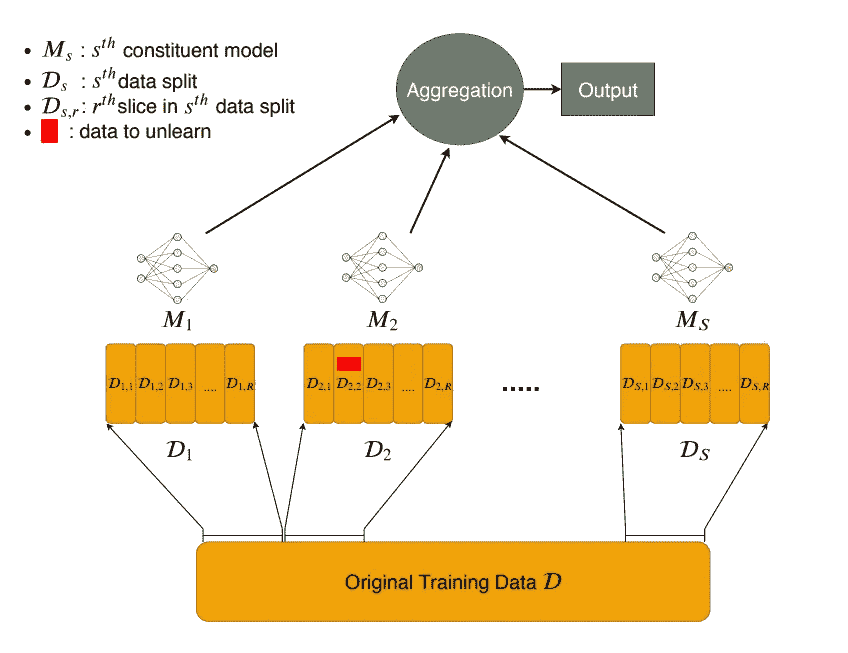

<!--yml

category: 机器学习

cate: 2024-05-07 15:40:38

-->

# 2024 年的机器反学习

> 来源：[`ai.stanford.edu/~kzliu/blog/unlearning`](https://ai.stanford.edu/~kzliu/blog/unlearning)

由[Ken Liu](https://ai.stanford.edu/~kzliu) ∙ May 2024 撰写

▸ 目录

+   1\. 反学习的历史和动机

+   2\. 反学习的形式

    +   2.1\. 精确反学习

    +   2.2\. 通过差分隐私进行“反学习”

    +   2.3\. 已知示例空间下的经验性反学习

    +   2.4\. 未知示例空间下的经验性反学习

    +   2.5\. 只需要求反学习吗？

+   3\. 评估反学习

+   4\. 反学习的实践、陷阱和前景

    +   4.1\. 反学习难度的谱系

    +   4.2\. 版权保护

    +   4.3\. 基于检索的 AI 系统

    +   4.4\. AI 安全

* * *

随着我们今天的机器学习模型变得越来越庞大，它们的（预）训练集也变得难以理解的庞大，[人们](https://unlearning-challenge.github.io/) [对](https://www.axios.com/newsletters/axios-ai-plus-117900d2-3a2c-4741-b807-bb8f2f9bb035.html?chunk=0&utm_term=twsocialshare#story0) [对](https://www.safe.ai/blog/wmdp-benchmark) [机器反学习](https://hbswk.hbs.edu/item/qa-seth-neel-on-machine-unlearning-and-the-right-to-be-forgotten) 概念越来越感兴趣，以编辑掉不需要的东西，如私人数据、陈旧知识、受版权保护的材料、有毒/不安全的内容、危险能力和错误信息，而无需从头开始重新训练模型。

机器反学习可以被广泛地描述为从已训练模型中移除训练数据的影响。在本质上，对于一个 *目标模型* 的反学习旨在产生一个等同于——或至少“行为像”—使用目标模型相同的数据训练的 *重新训练模型*，但减去了要反学习的信息。

上述描述中隐藏着很多内容。我们如何描述要反学习的信息？我们是否总是有地面真实的重新训练过的模型？如果没有，我们如何实际评估反学习？我们甚至能验证和审计反学习吗？假装反学习，就像人类经常做的那样，是否足够？反学习甚至是正确的解决方案吗？如果是，针对什么问题？

反学习的精确定义、技术、保证以及指标/评估将取决于：

1.  机器学习任务（例如，二元分类或语言建模）；

1.  要反学习的数据（例如，一组图像、新闻文章或制作 [凝固汽油](https://youtu.be/zjkBMFhNj_g?t=2774) 的知识）；

1.  反学习算法（例如，启发式微调 vs 删除模型组件）；

1.  反学习的目标（例如，用于用户隐私或有害内容的移除）。

在这篇教育性的文章中，我希望为普通的 ML 受众介绍机器遗忘，并涉及诸如[版权保护](https://arxiv.org/abs/2303.15715)、[纽约时报诉 OpenAI 案](https://www.nytimes.com/2023/12/27/business/media/new-york-times-open-ai-microsoft-lawsuit.html)、[被遗忘的权利](https://gdpr.eu/right-to-be-forgotten/)、[NeurIPS 机器遗忘挑战](https://unlearning-challenge.github.io/)、[基于检索的 AI 系统](https://arxiv.org/abs/2005.11401)、[AI 安全](https://www.mlsafety.org/)，以及我对这一领域的一些想法。虽然遗忘是一个广泛适用于大多数 ML 模型的广泛主题，但我们将重点关注[基础模型](https://en.wikipedia.org/wiki/Foundation_model)。

## 1\. 关于遗忘的一点历史和动机

人们已经思考了遗忘问题[一段时间](https://www.ieee-security.org/TC/SP2015/papers-archived/6949a463.pdf) [现在](https://proceedings.neurips.cc/paper/2019/hash/cb79f8fa58b91d3af6c9c991f63962d3-Abstract.html)。最初的研究探索主要是由 GDPR（欧盟的隐私法规）的[第 17 条](https://gdpr.eu/article-17-right-to-be-forgotten/)驱动的，通常被称为“[被遗忘的权利](https://gdpr.eu/right-to-be-forgotten/)”（**RTBF**）自 2014 年以来。RTBF 基本上表示用户有权要求从服务提供商（例如删除您的 Gmail 帐户）那里删除他们的数据。

RTBF 的初衷是好的。当服务提供商以结构化方式存储用户数据时，如谷歌以[回应](https://www.cnbc.com/2014/10/13/google-removes-170000-right-to-be-forgotten-links.html)RTBF 请求从其索引中删除了一堆链接时，它也是非常可行的。

然而，RTBF 并不是真正以机器学习为目标提出的。在 2014 年，决策者们不会预测到深度学习将成为数据和计算的巨大混合物，并且分离和解释这个混合物是困难的。从 ML 模型中删除数据的难度随后促使了所谓的“[数据删除](https://proceedings.neurips.cc/paper_files/paper/2019/file/cb79f8fa58b91d3af6c9c991f63962d3-Paper.pdf)”和“[机器](https://www.ieee-security.org/TC/SP2015/papers-archived/6949a463.pdf) [遗忘](https://arxiv.org/pdf/1912.03817.pdf)”的研究。

**十年后的 2024 年，用户隐私不再是取消学习的唯一动机。**我们已经从在面部图像上训练小型卷积网络转变为在有版权、[有毒](https://support.google.com/youtube/answer/6000976?hl=en)、危险以及其他有害内容上训练巨型语言模型，所有这些内容我们都可能希望从机器学习模型中“抹去”——有时只能使用少数示例来训练。模型的性质也发生了变化。人们开始使用一个[巨型模型](https://platform.openai.com/docs/models/gpt-4-turbo-and-gpt-4)，它几乎可以处理任何任务，而不是使用许多小型专门化模型，每个模型擅长一项任务。

目前，我认为取消学习的动机可以分为两类：

1.  **访问撤销**（思考取消对私有和受版权保护的数据的学习）。在理想的情况下，数据应该被视为“借用的”（可能是未经许可的），因此可以被“归还”，而取消学习应该使这种撤销成为可能。

    从这个角度来看，取消学习是具有挑战性的。一个关键困难是我们对深度学习本身的有限理解使得训练到模型中的数据类似于“可消耗品”（消耗后不能简单地“归还”）。数据也可能是不可替代的（例如，你的聊天记录），甚至可以被视为[劳动](https://www.radicalxchange.org/media/papers/data-freedom-act.pdf)，具有自己的财务和控制利益。另一个挑战是访问撤销可能需要取消学习的*证明*；正如我们将在接下来的章节中探讨的，这并不总是可能的。

    这些困难表明，也许值得重新审视像 RTBF 这样的法律，并考虑一些替代方案，例如*数据市场*，在那里，数据所有者能够得到适当的补偿，因此他们就不会首先要求取消学习。举例说明，假设 Bob 吃了 Alice 的芝士蛋糕（数据），Alice 更愿意 Bob 支付她或归还等价物（补偿），而不是 Bob 恢复到吃之前的状态（取消学习）。

    在实践中，实现访问撤销的一种方式是通过某种形式的*周期性重新训练*基础模型。许多模型提供者已经在做到这一点，以保持他们的模型具有竞争力和更新。例如，OpenAI 可以收集一堆取消学习请求，并在每年的重新训练中批量满足它们（或者，根据 RTBF 规定的“[不当延迟](https://gdpr.eu/right-to-be-forgotten/)”期限来满足请求）。更广泛地说，这提出了取消学习的*社会技术解决方案*：决策者可以强制执行这种周期性重新训练，并设定经济上可行的截止日期，将成本转嫁给模型所有者。

1.  **模型修正和编辑**（考虑毒性、偏见、过时/危险知识的移除）。也就是说，模型是在一些不良条件下训练的，我们希望修复它。这与[模型编辑](https://arxiv.org/abs/2110.11309)文献密切相关。最近提出了“[纠正型机器遗忘](https://arxiv.org/abs/2402.14015)”的概念，其中遗忘用于纠正不良数据的影响。从这个角度来看，遗忘也可以被视为用于 AI 安全问题的后训练风险缓解机制（在第四部分进一步讨论）。

    与访问撤销不同，对于模型修正我们可能会更宽容，因为编辑更多地是一种愿望，而不是法律所规定的必要性，就像图像分类的模型准确性或生成文本的毒性一样。 （当然，这些也可能造成真正的伤害。）在这里，我们不一定需要*正式保证*才能使遗忘在实践中有用；我们有很多例子可以证明，人们愿意部署被认为“足够安全”的模型。最近的[WMDP 基准测试](https://www.wmdp.ai/)，对模型进行有害知识的测试，是评估遗忘效果的很好的例子。

## 2。遗忘形式

如果我们能够仅仅重新训练模型而不使用不需要的数据，那么遗忘就会很轻松满足。然而，我们希望得到更好的结果，因为（1）重新训练可能很昂贵，（2）仅仅为了弄清楚从训练数据中删除什么可能会很费力—想想在一万亿标记中找出所有《哈利·波特》的引用。遗忘技术基本上旨在减轻或避免这种重新训练成本，同时产生相同或相似的结果。

遗忘文献可以大致分为以下几类：

1.  精确遗忘

1.  通过差分隐私“遗忘”

1.  实证遗忘，其中需要遗忘的数据是准确已知的（训练示例）

1.  实证遗忘，其中需要遗忘的数据是不确定的（思考“知识”）

1.  *仅仅*要求遗忘吗？

有时将 2-4 形式称为“**近似遗忘**”，因为遗忘的模型近似于重新训练的模型的行为。第 5 形式是相当新颖和有趣的，更具体地适用于遵循指令的模型。


图 1。近似遗忘的示意图。来源：[NeurIPS 机器遗忘挑战](https://unlearning-challenge.github.io)。

接下来，我们将简要介绍每种类型的大致情况，以及我认为的承诺、注意事项和展望中需要问的问题。

### 2.1。精确遗忘

精确遗忘大致要求遗忘模型和重新训练的模型*在分布上相同*；也就是说，它们可以在固定的随机性下完全相同。

精确取消学习的技术的特点是由[Cao & Yang](https://www.ieee-security.org/TC/SP2015/papers-archived/6949a463.pdf)和[SISA](https://arxiv.org/abs/1912.03817)的早期工作所决定的。在 SISA 中，采用了一个非常简单的方案，将训练集分成$N$个不重叠的子集，并为每个子集训练一个单独的模型。取消学习涉及到重新训练对应的模型，并且不包含要取消学习的数据点。这将成本从普通的重新训练中降低了$1/N$（如果我们保留模型检查点，则更便宜）。推理然后涉及模型集成。



图 2\. SISA 的说明：只需在数据碎片上训练模型([图片来源](https://arxiv.org/pdf/1912.03817))。

更一般地说，这种形式的精确取消学习的本质是，我们希望学习算法中的*模块化组件*对应于训练示例的不同（潜在的不相交）集合。

精确取消学习有几个好处：

1.  **算法 *即是* 证明**。如果我们实现类似 SISA 的东西，我们知道按设计，被取消学习的数据从未对其他组件有所贡献。事实证明，正式地证明模型已经取消学习了某些内容在其他情况下是相当具有挑战性的([挑战](https://arxiv.org/abs/2110.11891))。

1.  **它将取消学习问题转化为准确性/效率问题。** 由于取消学习评估的混乱和缺乏基准，这使得精确取消学习更容易接近。

1.  **设计解释性**。通过为学习提供结构，我们也更好地了解某些数据点如何影响性能。

主要缺点似乎很明显：大型模型的现代[扩展定律](https://en.wikipedia.org/wiki/Neural_scaling_law)反对 SISA 中所做的过度数据和模型分片。*难道是吗？* 我认为重新审视大型模型的情况下分片是非常有趣的，尤其是考虑到最近的[模型](https://arxiv.org/abs/2208.03306) [合并](https://arxiv.org/abs/2203.05482) [文献](https://huggingface.co/blog/mlabonne/merge-models)表明了大型模型之间的权重空间合并的可行性。正如我们将在接下来的部分中了解到的那样，近似取消学习及其评估的混乱，特别是在大型模型的情况下，使得精确取消学习非常有吸引力。

### 2.2\. 通过差分隐私进行“取消学习”

这一系列工作大致上说：如果模型在有或没有任何特定数据点的情况下表现基本相同，那么我们就不需要从该数据点取消学习任何内容。更广泛地说，我们要求未学习和重新训练的模型之间的*分布接近性*。

对于不熟悉差分隐私（DP）在机器学习中的读者，DP 定义了在数据集$X$，$X'$上训练的两个模型$M$，$M'$之间的*可量化*的不可区分性保证，这些数据集在任何单个训练示例上有所不同。经典的过程，[DP-SGD](https://arxiv.org/abs/1607.00133)，通过裁剪每个示例梯度的 L2 范数并向梯度注入一些每个坐标的高斯噪声来工作。其思想是噪声会掩盖或模糊任何单个梯度（示例）的贡献，使最终模型不会对任何示例敏感。它通常由（$\varepsilon, \delta$）-DP 表示；噪声越强，标量（$\varepsilon, \delta$）越小，隐私性越强。

直觉是，如果对手不能（可靠地）区分模型，那么这个数据点就好像从未被学习过一样，因此不需要取消学习。DP 可以用来实现这种形式的取消学习，但由于取消学习的单边性（我们只关心数据的删除，而不关心添加），DP 是一个[严格更强的定义](https://arxiv.org/abs/2103.03279)。这种取消学习的概念有时被称为“**（$\alpha, \beta$）-取消学习**”，其中（$\alpha, \beta$）类似于用于测量分布接近度的（$\varepsilon, \delta$）。

沿着这个方向的示例技术包括：[(1)](http://proceedings.mlr.press/v132/neel21a.html)存储（DP）凸模型的检查点，并且取消学习是从这些检查点重新训练；以及[(2)](https://proceedings.neurips.cc/paper/2021/hash/87f7ee4fdb57bdfd52179947211b7ebb-Abstract.html)在前一项技术的基础上，为*自适应*取消学习请求添加 SISA（即在观察到发布的模型后出现的请求）。

基于 DP 的取消学习之所以好是因为它提供了某种形式的统计保证。**但是，有一些重要考虑因素限制了它对大型模型的适用性**：

1.  许多此类取消学习结果仅适用于[凸](http://proceedings.mlr.press/v132/neel21a.html) [模型](https://arxiv.org/abs/1911.03030)或[损失](https://proceedings.neurips.cc/paper/2021/hash/87f7ee4fdb57bdfd52179947211b7ebb-Abstract.html)。

1.  哪些取消学习水平（$(\varepsilon, \delta)$-DP 或$(\alpha, \beta)$-取消学习的值）是足够的？*谁来决定？*

1.  对于大型模型，当前的机器学习系统与 DP 类似的程序的*每个示例*工作负载不匹配。内存开销也将是禁止的。

1.  此外，像差分隐私（DP）一样，随着更多的取消学习请求（最佳情况下是$O(\sqrt k)$，其中$k$是遵循 DP 组合定理的请求），保证可能会迅速减少。

1.  类似 DP 的定义隐含地假设我们对所有数据点*都一视同仁*。但是，有些例子更有可能收到取消学习请求，而有些例子根本不会[对学习有贡献](https://arxiv.org/abs/1906.01827)。

1.  类似 DP 的程序有时也会严重损害模型的准确性，有时以一种[不公平](https://arxiv.org/abs/1905.12101)的方式。

特别是对于大型模型，值得区分**取消学习预训练数据**与**取消学习微调数据**的情况。后者更容易处理；例如，我们确实可以使用微分隐私对大型模型进行微调，但对于预训练来说则不太容易。

### 2.2.1\. *伪造*及其对类似 DP 取消学习定义的影响

取消学习过程有时可能需要外部*审计*，意味着我们希望证明取消学习过程确实已发生。

“[伪造](https://arxiv.org/abs/2110.11891)”的主要思想是存在两个不同的数据集，当对其进行训练时，将产生*相同的梯度和（因此）相同的模型*。这在直觉上是正确的：

1.  将点线性回归至完美直线；移除任意一个点都不会改变拟合的直线；

1.  想象一下小批量 GD，其中将一个示例梯度替换为几个“假”梯度的总和会产生相同的批量梯度。

**伪造意味着基于 DP 的近似取消学习可能无法通过审核**——也就是说，取消学习服务提供者无法正式证明遗忘集确实被遗忘了。事实上，如果我们只看模型权重，即使是精确取消学习也可能无法通过审核。

虽然有人可能认为这是一个理论结果，但这意味着政策制定者应该仔细考虑未来“被遗忘权”（如果有的话）应该是什么样子，以及类似的政策是否在法律上和技术上可执行。

实际上，什么样的“审计”合格可能会很大程度上取决于定义和应用。如果审计员只关心取消学习模型在指定输入集上的表现（例如在一组面部图像上），那么即使是经验性取消学习也是“可审计的”（见下一节）。

### 2.3\. 已知示例空间的实证取消学习（“示例取消学习”）

这一工作线路本质上是“训练以取消学习”或“通过微调取消学习”：只需采取几个启发式选择的梯度步骤来塑造原始模型的行为为*我们认为*重新训练的模型会做的事情（同时也可以选择重置模型中的一些参数）。它也可以被称为“示例取消学习”，因为训练、保留和遗忘集通常是明确定义的。

[**NeurIPS 2023 机器取消学习挑战**](https://unlearning-challenge.github.io/)收集了许多沿着这个方向的方法。挑战大致如下进行：

+   您将获得一个带有指定保留/遗忘示例拆分的面部图像数据集，一个在所有内容上进行训练的目标模型，以及一个仅在保留集上训练的秘密模型。

+   要求您设计一个取消学习算法，从目标模型生成与秘密保留模型“匹配”的取消学习模型。

+   “匹配”或评估指标在 512 个种子上使用类似 DP 的输出空间相似性：对于每个遗忘示例，基于对手的真/假正例率在 512 个未学习模型上计算一个“经验性 $\varepsilon$”，并在示例之间进行聚合。

+   所有模型都是小型卷积网络。

为了直观地说明经验性遗忘的效果，而不完全解释指标：地面实况重新训练模型大约得到~0.19，获胜的提交达到了~0.12，而基线（在遗忘集上进行简单的梯度上升）为~0.06。

那么获胜的想法是什么样的呢？大致如下：

1.  在遗忘集上进行梯度上升；

1.  在保留集上进行梯度下降（并希望灾难性遗忘会处理未学习的内容）；

1.  在遗忘集上进行梯度上升，但标签是均匀随机的（以“混淆”模型）；

1.  在保留集上最小化未学习模型和原始模型输出之间的 KL 散度（以规范化未学习模型在不相关数据上的性能）；

1.  重新初始化在保留集和遗忘集上具有相似梯度的权重，并在保留集上微调这些权重；

1.  通过 L1 范数将 99%的权重修剪掉，并在保留集上进行微调；

1.  重置第一个/最后一个 $k$ 层并在保留集上进行微调；以及

1.  上述启发式/任意组合。

实际上，尽管这些方法的启发式性质，但这些是目前[大多数](https://arxiv.org/abs/2302.09880) [经验性](https://arxiv.org/abs/2210.01504) [遗忘](https://arxiv.org/abs/2305.06535) [算法](https://arxiv.org/abs/2201.06640)，特别是那些[在](https://arxiv.org/abs/2310.10683) [大型](https://arxiv.org/abs/2310.20150) [（语言）](https://www.microsoft.com/en-us/research/project/physics-of-agi/articles/whos-harry-potter-making-llms-forget-2/) [模型](https://arxiv.org/abs/2403.03218)，如今正在做的事情。

人们探索经验性方法是因为理论工具通常不实用；例如，简单地强制执行 DP 会大大降低准确性和效率，即使对于拥有丰富 GPU 的情况也是如此。另一方面，经验性方法通常快速且易于实现，并且它们的效果通常在定性上是可见的。

经验性遗忘的另一个关键动机是*反事实*不清楚，特别是在 LLMs 上。在深度学习中，我们经常不知道重新训练的模型在未见数据上的行为。如果不是政治家，LLM 应该认为拜登是什么？图像分类器对未学习的图像是否应该给出均匀随机的预测？它们是否泛化？或者它们是否自信地错误？这些都是可能的，而且可以由从业者决定。这也意味着*同样合理的行为可能导致截然不同的测量*（例如，未学习和重新训练模型输出分布之间的 KL 散度），从而使理论保证变得更加复杂。

### 2.4\. 对未知示例空间进行经验性遗忘（“概念/知识遗忘”）

如果列车、保留或遗忘集指定不好或根本不指定会怎么样？训练在互联网规模的数据上的基础模型可能会收到取消学习“[概念](https://openaccess.thecvf.com/content/ICCV2023/papers/Gandikota_Erasing_Concepts_from_Diffusion_Models_ICCV_2023_paper.pdf)”，“[事实](https://proceedings.neurips.cc/paper_files/paper/2022/file/6f1d43d5a82a37e89b0665b33bf3a182-Paper-Conference.pdf)”，或一条“[知识](https://arxiv.org/abs/2305.14795)”的要求，这些要求我们无法轻易关联一组示例。术语“**模型编辑**”、“**概念编辑**”、“**模型手术**”和“**知识取消学习**”与取消学习的这种概念密切相关。

取消学习请求的不明确意味着我们现在必须处理“**取消学习范围**”（或“[编辑范围](https://arxiv.org/abs/2206.06520)”）和“[**蕴涵**](https://en.wikipedia.org/wiki/Textual_entailment)”的概念。也就是说，取消学习请求可能提供[典型示例](https://arxiv.org/abs/2402.06155)以指示要取消学习的内容，但相同的信息可以以许多不同的形式和许多不同的下游影响出现在（预）训练集中，因此仅仅实现这些示例的取消学习，即使*完全*也是不够的。

例如：

+   关于“拜登是美国总统”的关联信息分散在来自新闻文章、书籍、日常短信或本文的各种形式的文本中。我们是否可以取消学习所有出现的情况？此外，取消学习乔·拜登是否也意味着取消学习[拜登的猫](https://en.wikipedia.org/wiki/Willow_(cat))的颜色？

+   艺术家可能要求通过提供艺术样本来取消学习艺术风格，但他们可能无法收集到他们在互联网上拥有的一切和他们的[改编作品](https://www.businessinsider.com/ai-image-generators-artists-copying-style-thousands-images-2022-10)。

+   纽约时报可能要求取消学习新闻文章，但他们不能列举这些文章的引用和二次转换。

这种含糊也表明，**从大型模型中取消预训练数据可能是必须经验性的：**如果我们无法清楚地指定要（和不要）在数万亿标记中取消学习，并在不同实体之间建立明确的信息边界，那么很难推导出正式的保证。通过经验性地实现取消学习的一个有趣的含义是，*取消学习本身*可以被[取消学习](https://arxiv.org/abs/2401.01814)。

那么，现有工作如何处理未明确说明的遗忘请求呢？大多数技术或多或少与之前相同，只是现在我们还需要找到要进行微调的示例。例如，试图遗忘[哈利·波特](https://arxiv.org/abs/2310.02238)涉及要求 GPT-4 提出可信的替代文本完成（例如，波特先生改为研究烘焙而不是魔法）；而试图遗忘[有害行为](https://arxiv.org/abs/2310.10683)则需要收集仇恨言论的例子。

另一组技术涉及将所需的行为（或其相反）训练到[任务](https://arxiv.org/abs/2212.04089)/[控制](https://arxiv.org/abs/2403.03218)[向量](https://arxiv.org/abs/2306.14870)中，并利用大型模型具备的能力进行[权重空间合并](https://huggingface.co/docs/peft/en/developer_guides/model_merging)或[激活转向](https://arxiv.org/abs/2310.01405)。以上的基本方法或多或少是相同的，然而——获取这些编辑向量涉及（启发式地）设计要采取的梯度和采取这些梯度的数据。人们还可以将遗忘问题框定为一个*对齐*问题，并应用[DPO 类似的目标](https://arxiv.org/abs/2404.05868)来忘记例子。

### 2.5\. 只是*要求*遗忘？

事实证明，像 GPT-4 这样强大的、遵循指令的 LLMs 足够聪明，可以*假装遗忘*。这意味着制定提示来诱导（足够）安全的行为，以用于目标遗忘应用程序。

这是一种有趣的方法，因为从系统的角度来看，完全没有涉及到任何梯度（这是一个很大的优势），直观上最终的结果可能会像现有的经验性遗忘技术一样[好](https://arxiv.org/abs/2403.03329)。在我们可以提示的不同方式中，过去的工作探索了以下两个方向。

**[直接询问](https://arxiv.org/abs/2403.03329)**来假装遗忘。我们可以在系统提示中询问，比如，假装不知道谁是哈利·波特。从设计上来说，这对于常见的实体、事实、知识或行为（例如像特朗普那样说话的能力）效果最佳，因为 LLM 需要*很好地知道它才能假装不知道它很好*。另一方面，假设现在我们想要遗忘一个不知名人士的地址；预训练集如此之大，以至于我们怀疑它是训练数据的一部分。我们现在面临的是[斯特莱桑德效应](https://en.wikipedia.org/wiki/Streisand_effect)的一个变体：甚至值得问模型通过准确地描述它的上下文来假装遗忘，并随后[冒泄露的风险](https://arxiv.org/abs/2402.17840)吗？

**少量提示或“[上下文取消学习](https://arxiv.org/abs/2310.07579)”**。假设现在我们有一组明确定义的忘记示例及其相应的标签。我们可以*翻转*它们的标签，并将它们与更多具有正确标签的保留示例一起放入提示中，直觉是模型会将这些错误标记的忘记示例视为真实并据此行事——就像一个人可以用这种方式[越狱](https://www.anthropic.com/research/many-shot-jailbreaking)一个模型一样。 ^(实际上，当忘记示例和反事实标签明确定义且（在某种程度上）有限时，这种方法效果最好。通过枚举*大量*示例，它*可能*适用于事实关联（例如，巴黎是法国的首都），但不太可能适用于取消学习有毒行为（其中可能输出的空间要大得多）)。

在某种意义上，这些方法是互补的，因为它们适用于不同类型的取消学习请求。

**更广泛地说，人们可以想象一个用于取消学习的*盒装*LLM 系统，其中**：

1.  只有输入和输出接口是公开的（就像 ChatGPT）；

1.  强大的 LLM 的不同实例负责准确模拟所需取消学习行为的不同部分（例如，一个 LLM 实例专门处理一般的琐事式 QA，而另一个处理序列完成）；

1.  一个编排者/路由器 LLM 根据输入决定调用哪个取消学习工作者实例；和

1.  一个作曲家/总结者 LLM，起草符合所需取消学习行为的最终输出；它也可以应用一些输出过滤。

有些读者可能会对这种基于启发式的提示技术的本质抱怨；即没有任何取消学习的证据。我们应该记住，像最近的方法一样基于经验的微调取消学习可能并不根本不同。我认为最终归结为以下问题：

1.  微调或提示哪个能**更好地引导模型行为**？

1.  其中哪些**更不容易受到攻击**（暴露的表面更少和/或需要对手更多的努力来恢复取消学习）？

我对我们当前模型的直觉是，这两个问题都指向基于微调的取消学习，但这在辩论中非常有待商榷，并且随着我们获得更强大的模型和更好的防御机制而可能发生变化。例如，最近提出的[指令层次结构](https://arxiv.org/abs/2404.13208)的概念可能有助于使这样的 LLM 系统不那么容易受到恶意提示的影响。

**值得注意的是，人类实际上也不会“取消学习”一段知识。**实际上，通过声称已经取消学习某事，我们通常：（1）不仅仅是学会了它以便能够做出我们已经取消学习它的声明，并且（2）有意识地决定不再将这些知识应用于我们当前的世界状态。谁又能说 LLM 的取消学习应该有什么不同呢？

## 3\. 评估取消学习

对于许多原因，遗忘是混乱的。但关于遗忘的最大问题之一是评估。一般来说，我们关心三个方面：

+   **效率**：与重新训练相比，算法有多快？

+   **模型效用**：我们是否损害了对保留数据或正交任务的性能？

+   **遗忘质量**：多少“遗忘数据”实际上是未被学习的？我们能多快地恢复（重新学习）它们？

评估效率和模型效用更容易；我们在训练期间已经对它们进行了测量。关键挑战在于理解遗忘质量。

如果指定了遗忘示例，这也感觉很容易。例如，直觉上，遗忘特定图像类别意味着在该类别的图像上获得接近机会的准确率。评估协议可以测量[准确性](https://arxiv.org/abs/2310.20150)（在保留和测试集上高，在遗忘集上低）或遗忘文本序列的[可能性](https://arxiv.org/abs/2210.01504)（越低越好）。

然而，这些直观的指标选择未必是原则性的或可扩展到 LLMs 中的知识遗忘设置。期望模型在遗忘的图像上表现不佳忽视了**泛化**，因为遗忘示例很可能是某些保留示例的插值/重复。我们并不总是有从未见过遗忘示例的 oracle 模型；例如，我们是否有从未见过《纽约时报》文章的 LLMs？

对 LLMs 的遗忘进行评估更像是一门艺术而不是科学。例如，要忘记“哈利·波特”作为一个实体，人们会[可视化](https://www.microsoft.com/en-us/research/project/physics-of-agi/articles/whos-harry-potter-making-llms-forget-2/)标记概率如何因与哈利·波特相关的文本而衰减—然后其他人会过来展示模型确实仍然可以[回答](https://swj0419.github.io/detect-pretrain.github.io/)哈利·波特的小知识问答。关键问题是对于遗忘评估的数据集和基准的**迫切**缺乏。

然而，自 2024 年以来，基准评估危机正在好转。有两个值得关注的最近项目：

+   [TOFU](https://locuslab.github.io/tofu/)：一个专注于遗忘个体（特别是书籍作者）的基准。它涉及要求 GPT-4 创建虚假的作者档案，对它们进行微调，使用微调后的 LLM 作为遗忘目标模型，将原始 LLM 作为 oracle“重新训练”模型。它提供了关于生成的虚假作者的 QA 对，以评估模型在应用遗忘前/后对这些作者的知识。

+   [WMDP](https://www.wmdp.ai/)：一个关注危险知识遗忘的基准，特别关注生物安全、网络安全和化学安全。它提供了 4000 多个多项选择题，用于测试模型在应用遗忘前/后的危险知识。作为报告的一部分，作者还提出了一种基于激活导向的经验遗忘方法。

TOFU 和 WMDP 与先前的忘却评估不同之处在于它们都是“高级”的，并且侧重于模型的*知识保留和理解*，而不是像忘记序列困惑度这样的例级指标。这对于 LLMs 尤为重要，因为它们通常能够以许多不同的方式给出相同的答案，而例级指标无法捕捉到这一点。

展望未来，我认为像 TOFU 和 WMDP 这样的**面向应用的忘却基准**，与[NeurIPS 忘却挑战](https://unlearning-challenge.github.io/)的基于实例的评估不同，对于评估基础模型更加有用，因为这些模型具有多任务性质，而且对于这些任务的“忘却成功”的不同定义。事实上，人们可以想象对 PII、受版权保护的内容、语音毒性甚至模型[后门](https://arxiv.org/abs/2401.05566)进行单独的忘却基准。例如，对于忘却 PII，我们可能关心的是确切的令牌重复，而对于毒性，忘却指标将是由[ToxiGen](https://arxiv.org/abs/2203.09509)分类器报告的得分。

## 4\. 忘却的实践、陷阱和前景

忘却是一个难题，特别是在基础模型的背景下。当我们积极研究如何使忘却在实践中起作用时，对于忘却的真正含义以及它是否是当前问题的正确解决方案进行一些哲学思考是有帮助的。

### **4.1\. 忘却难度的光谱**

直觉上，像 Palo Alto 中的车祸这样的 LLMs 中不频繁的文本出现应该比像“拜登是美国总统”这样的频繁出现更容易，而后者又比“太阳每天升起”这样的基本事实更容易。

这种*忘却难度的光谱*之所以出现，是因为随着一段知识变得更加基础，它将与其他知识片段（例如前提或推论）有更多的关联，并且存在指数级别的更大的忘却范围。事实上，一段知识可能在模型的隐式知识图中被如此嵌入，以至于无法在不*引入矛盾*并损害模型效用的情况下忘记。

这种直觉暗示着某些忘却请求要困难得多，或者根本无法满足（任何尝试都注定会有缺陷）。事实上，人类有经验，这些经验构成了他们后续行动和世界模型的基础；就人类能够忘记他们形成的过去记忆的能力而言，这是主观的、模糊的和哲学性的。

更广泛地说，忘却难度问题适用于所有类型的模型，并且出于嵌入在知识/蕴含图中的原因以外的原因。让我们考虑两种看似矛盾的关于忘却难度的直觉：

1.  训练后见到的示例应该是*容易被遗忘*的，因为模型在权重空间中只会微微移动（例如由于衰减的学习速率），可以只需恢复梯度或回滚到先前的检查点（如果已存储）。 相比之下，早期见到的示例会被后来的示例“建立在其上”（在课程学习的意义上），使它们更难以被遗忘。

1.  后来见到的示例应该是*更难被遗忘*的，因为早期见到的示例会在训练过程中逐渐（或灾难性地）[被遗忘](https://arxiv.org/abs/2207.00099)；这对 LLMs 可能尤其正确。

未能协调这些直觉会表明，对*记忆/遗忘*、*示例重要性*（在数据[选择](https://arxiv.org/abs/2305.10429)和[核心集](https://arxiv.org/abs/1906.01827)的意义上）、*学习难度*（在[预测翻转](https://arxiv.org/abs/2210.15031)的意义上），以及遗忘难度之间的相互作用是不明确的。

**以下是一些有趣的研究问题**：

+   是否有遗忘“容易”数据（例如地方新闻事件）和“困难”数据（例如猫有四条腿）之间的质量/基本差异？

+   如果存在一个遗忘难度的光谱，是否存在一个阈值来区分“容易”和“困难”，因此决定何为不可遗忘或不应遗忘？是否存在，或者我们能够训练出这样一个预言分类器？甚至人类能分辨吗？

+   这如何与**影响函数**和**数据归因**相关？如果某一知识点（如它在模型输出中的体现）可以归因于更大一部分的训练数据，这是否使它更难以被遗忘？

+   我们能否评估遗忘某事的难度？

### 4.2\. 版权保护

表面上看，遗忘似乎是解决版权保护的一个有前途的解决方案：如果模型侵犯了某些内容的版权，我们可以尝试遗忘该内容。 ^(可以想象，为了通过遗忘解决版权侵权问题，需要可证明并确切的遗忘是必要的（可能足够）；另一方面，近似遗忘，没有担保并存在被黑客攻击的可能性，显然是不足够的，也可能是不必要的。)

然而，在实践中，由于当前遗忘方法的有效性受到质疑，以及在人工智能和版权之间的[不明确的法律环境](https://arxiv.org/abs/2303.15715)，存在更多细微之处。由于我不是法律专家（很显然，本节的内容并不构成法律建议），我们将主要关注提出问题。中心问题似乎是：**遗忘是否是版权保护的正确解决方案？**

请注意 [公平使用](https://en.wikipedia.org/wiki/Fair_use) 原则 ^(允许有限使用受版权保护的材料，取决于四个因素：（1）使用的目的和性质（“变革性”），（2）受版权作品的性质，（3）使用的数量和实质性，以及（4）对材料价值的影响。如果在模型中使用的受版权内容符合公平使用标准，则取消学习此类内容无需必要。)

假设一个模型是在某些受版权保护的内容上进行训练，并且存在版权侵犯的风险，就像 [《纽约时报》诉 OpenAI](https://www.nytimes.com/2023/12/27/business/media/new-york-times-open-ai-microsoft-lawsuit.html) 中的情况。OpenAI 应该投资于 ChatGPT 上的（经验主义的）取消学习算法吗？或者他们应该专注于公平使用的变革性轴，并投资于部署经验 *防护栏*，例如提示、内容审核和定制对齐，以防止模型重复训练数据？后者似乎是实践中正在实施的方法。

**更广义地说，也可以有经济上的解决方案来替代取消学习以解决版权侵犯问题。** 例如，模型所有者可以提供精确的取消学习服务（例如通过定期重新训练），同时在此期间为版权侵权向模型用户提供赔偿，就像在 OpenAI 的 “[版权护盾](https://openai.com/blog/new-models-and-developer-products-announced-at-devday)”案例中所见。人们也开始 [探索](https://arxiv.org/abs/2404.13964) 如何使用 Shapley 值对受版权保护的数据定价。总的来说，目前还不清楚取消学习在解决与版权相关的问题中将发挥多大作用（如果有的话）。确切的取消学习（扩展到基于检索的系统，见下一节）确实很有希望，因为删除是干净且可证明的，但似乎需要首先建立 *具有法律约束力的* 审计程序/机制。

### 4.3\. 基于检索的人工智能系统

不学习的一个明显替代方案是根本不学习。对于一个大型语言模型，这种情况可能表现为，我们从预训练集中获取可能会收到取消学习请求的所有内容（例如，《纽约时报》文章）并将其放入外部数据/向量存储。然后，在推断过程中，任何涉及这些内容的问题都将通过 [RAG](https://arxiv.org/abs/2005.11401) 进行处理，任何取消学习请求都可以通过从数据库中删除数据轻松满足。[Min 等人](https://arxiv.org/abs/2308.04430) 演示了这种方法在最终困惑度方面可以与（虽然不完全匹配）训练基准相竞争。

基于检索的解决方案是有希望的，因为基础模型在推理上下文中的能力不断增强。然而，在将检索系统作为取消学习的不费思考之举之前，需要考虑一些问题：

1.  **从预训练语料库中移除受保护的内容可能是一个难以重复的问题。** 就像移除数据污染一样[困难](https://lmsys.org/blog/2023-11-14-llm-decontaminator/)，我们如何确保受保护内容的释义、引用/引证或其他改编已被移除？

1.  **如果要去学习的数据无法检索怎么办？** 今天我们对模型进行了许多微调，其中包括不是文档或知识项的东西；例如，目前还不清楚（但）像人类偏好和期望行为（例如写作简洁的能力）这样的事情是否可以从数据库中“检索”出来。

1.  **将内容随机丢入环境中可能会打开新的攻击面。** 许多 RAG 方法用于 LLMs 的工作方式是将相关内容放入上下文中，并要求模型对其进行推理。将受保护的数据置于上下文中意味着它们现在更容易受到数据提取的影响（简单的提示攻击可能会起作用，[fine](https://arxiv.org/abs/2402.17840)）。

1.  **检索和训练之间的效用差距。** 虽然有证据表明检索型解决方案可以竞争，但并没有普遍的共识认为仅靠检索就可以替代精细调整工作负载；事实上，它们可以是[互补的](https://arxiv.org/abs/2401.08406)。更广泛地说，如果不可学习数据的空间太大，以至于如果所有数据都进入外部存储，基本模型就不会那么有用，那么怎么办？

### 4.4\. AI 安全

随着模型的能力越来越强，并被授予[代理](https://lilianweng.github.io/posts/2023-06-23-agent/)，一个具体的应用领域为去学习的[AI 安全](https://www.gov.uk/government/topical-events/ai-safety-summit-2023)正在[获得](https://www.cnn.com/2024/04/26/tech/openai-altman-government-ai-safety-panel/index.html) [关注](https://www.cnn.com/2024/04/26/tech/openai-altman-government-ai-safety-panel/index.html)。

大致而言，安全性问题源于模型的*知识*（例如，[凝固汽油的配方](https://youtu.be/zjkBMFhNj_g?t=2774)）、*行为*（例如，展示[偏见](https://arxiv.org/abs/2402.02680)）和*能力*（例如，[黑客攻击](https://arxiv.org/abs/2402.06664)网站）。检查当前的 AI 系统并推断，可以想象以下示例应用于去学习并提高 AI 安全性：

+   移除**危险知识**，正如[WMDP](https://www.wmdp.ai/)基准所示；

+   移除**模型的[毒药](https://arxiv.org/abs/2302.10149)和[后门](https://arxiv.org/abs/2401.05566)**，即模型对敌对植入的输入触发器做出响应；

+   移除**[操纵性](https://www.nytimes.com/2023/02/16/technology/bing-chatbot-microsoft-chatgpt.html)行为**，例如执行不道德的劝说或欺骗能力；

+   移除**[偏见](https://arxiv.org/abs/2402.02680)和[有毒性](https://arxiv.org/abs/2212.08061)**；甚至

+   移除**[追求权力](https://arxiv.org/abs/2206.13353)倾向**。

对于以安全为导向的应用程序，值得注意的是，去学习应该被视为一种后训练的*风险缓解和防御机制*，与现有的工具（如对齐微调和内容过滤器）并列。和任何工具一样，我们应该通过与工具箱中其他工具的权衡（例如，与内容过滤器相比，去学习更具适应性但更昂贵），而不是因为可能缺乏保证和效力而将其搁置。

* * *

**致谢**：作者要感谢 Aryaman Arora、Jiaao Chen、Irena Gao、John Hewitt、Shengyuan Hu、Peter Kairouz、Sanmi Koyejo、Xiang Lisa Li、Percy Liang、Eric Mitchell、Rylan Schaeffer、Yijia Shao、Chenglei Si、Pratiksha Thaker、Xindi Wu 在起草本文之前和期间进行的有益讨论和反馈。任何火爆/糟糕的看法都属于作者本人。

* * *

**引用**

如果您觉得这篇文章有帮助，可以引用为：

刘子瑜（2024 年 4 月）。2024 年机器去学习。刘子瑜 - 斯坦福大学计算机科学。[`ai.stanford.edu/~kzliu/blog/unlearning`](https://ai.stanford.edu/~kzliu/blog/unlearning)。

或

```
@misc{liu2024unlearning,
  title   = {Machine unlearning in 2024},
  author  = {Liu, Ken Ziyu}
  journal = {Ken Ziyu Liu - Stanford Computer Science},
  year    = {2024},
  month   = {Apr},
  url     = {https://ai.stanford.edu/~kzliu/blog/unlearning},
} 
```

* * *


