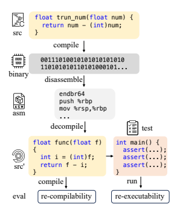
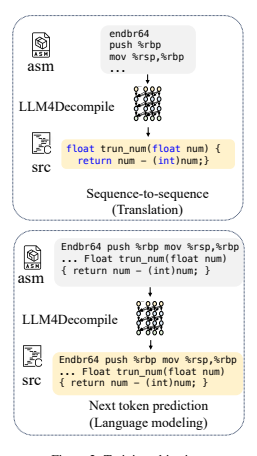
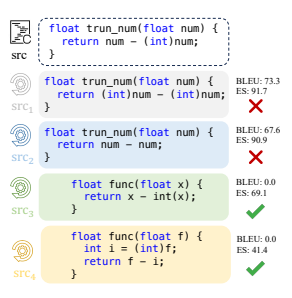

<!--yml
category: 大模型
date: 2022-07-01 00:00:00
-->

# LLM4Decompile：用大型语言模型反编译二进制代码

arxiv2403.05286

Hanzhuo Tan, Qi Luo, Jing Li, Yuqun Zhang Southern University of Science and Technology The Hong Kong Polytechnic University

## Abstract

反编译旨在将编译后的代码恢复为人类 可读的源代码,但在名称和结构等细节 方面存在困难。大型语言模型(llm)在编程 任务中表现出了希望,激励了它们在反 编译中的应用。然而,不存在任何用于 反编译的开源LLM。此外,现有的反编译 评估系统主要考虑标记级精度,而在很 大程度上忽略了代码的可执行性,而可 执行性是任何程序最重要的特性。本文发 布了第一个开放访问的反编译llm,范围 从1B到33B,对40亿个C源代码token和相 应的汇编代码进行了预训练。开源llm可以 作为该领域进一步开发的基线。为确保实 际的程序评估,引入了Decompile-Eval, 这是第一个考虑反编译的重编译性和重 可执行性的数据集。该基准强调了从程 序语义角度评估反编译模型的重要性。实 验结果表明,llm4反编译器能够精确反编 译21%的汇编代码,比GPT-4反编译性能 提高了50%。我们的代码、数据集和模型 发布在https://github.com/albertan017/ LLM4Decompile。

## 1 简介 

反编译是将编译后的机器码或字节码转换回高 级编程语言的过程。当源代码不可访问时,这 通常是为了分析软件的工作原理(Brumley et al.,
2013; Katz et al., 2018; Hosseini and Dolan-Gavitt, 2022; Xu et al., 2023; Armengol-Estapé et al.,
2023; Jiang et al., 2023; Wong et al., 2023)。已 经开发了许多反编译工具,如Ghidra (Ghidra, 2024)和IDA Pro (Hex-Rays, 2024)。尽管这些工 具在特定场景下能够将二进制代码还原为源 代码,但它们通常无法生成易于人类阅读的 代码。反编译固有的困难在于不能完全重新 创建源代码,特别是像变量名(Lacomis et al.,
2019)和主要结构(Wei et al., 2007)这样的更精 细的细节,如循环和条件语句,这些往往在编 译过程中丢失。

大型语言模型(llm)的最新进展促使研究人员 将编程语言作为不同的语言系统,使用预训 练代码llm完成各种编码任务(Lippincott, 2020;



Rozière et al., 2023; Guo et al., 2024)。这些模 型比传统技术表现出了令人印象深刻的性能 改进(Zeng et al., 2022; Xu et al., 2022),这使我 们有可能应用llm来应对反编译挑战。举例来 说,Slade (Armengol-Estapé et al., 2023)和Nova
(Jiang et al., 2023)等基于transformer的模型展 示了使用语言模型将二进制代码转换回源 代 码 的 潜 力 , 这 些 代 码 在 可 读 性 和 结 构 上 更 接 近 源 代 码 。 然 而 , 其 模 型 的 范 围 在Slade和Nova的200M和1B参数上有所限制, 这可能导致学习和泛化能力的降低,而更大 的模型通常通过利用其广泛的参数来处理和集 成更广泛的信息范围(Rozière et al., 2023; OpenAI, 2023),在这些领域表现出显著的改善。

此外,它们缺乏公开可用性,限制了它们在促 进这一领域的进一步进展方面的贡献。此外, 据我们所知,没有标准化的基准数据集用于 评估和比较反编译技术。研究人员倾向于使用 不同的数据集(da Silva et al., 2021; Collie et al.,
2020; Tan et al., 2017)来评估他们的结果,这使 得直接比较变得困难。因此,迫切需要建立评 测反编译性能的基准,为反编译领域的评测标 准制定提供有力支持。

因此,我们的目标是创建和发布第一个致 力于反编译的开源LLM,并通过构建第一个 专注于重新编译和重新执行的反编译基准 来评估其能力。我们首先使用GCC(Stallman et al., 2003)使用不同配置将来自AnghaBench
(da Silva et al., 2021)的100万个C代码示例编译 为汇编代码,形成一个由40亿个token组成的 汇编-源对数据集。然后,我们使用此数据集 对前沿代码LLM——DeepSeek-Coder模型(Guo et al., 2024)进行微调。其次,基于HumanEval
(Chen et al., 2021)试题和测试样本构建了评测 基准——Decompile-Eval;具体地,我们从反编 译代码能否成功重编译和是否通过测试用例 中的所有断言两个角度来表述评估。图1展 示了我们的反编译评估所涉及的步骤。首 先,GCC编译器使用特定参数(如优化级别)编 译源代码(表示为src),以生成可执行的二进 制文件。然后使用objdump工具将该二进制文 件反汇编成汇编语言(表示为asm)。汇编指 令随后被反编译,以人类可读的格式(表示 为src′)重建源代码。为了评估反编译代码的 质量(src′),需要测试用原始GCC编译器重新 编译代码的能力(重新编译能力)以及通过测试 断言测试代码的功能(重新执行能力)。

在decompile - eval上,llm4反编译模型在其 反编译二进制文件的能力方面表现出了有希望 的结果,令人印象深刻的是,90%的反编译代 码可以使用GCC编译器中的相同设置重新编 译,这表明对代码结构和语法有扎实的理解。 在代码执行能力方面,从6B版本得到的21%
的反编译代码成功地捕获了程序的语义并通过 了所有测试用例。

总之,我们的贡献有两方面: - 本文提供了第一个开源的LLM,范围 从1B到33B,为反编译量身定制,也促进了 编译和各种二进制任务。

- 本文构建了第一个以重编译和重执行率为 目标的反编译基准,表明语法恢复和语义保持 对可用和健壮的反编译至关重要。

## 2 相关工作 

## 2.1 反编译

将可执行二进制文件反转为源代码形式的实 践,即反编译,已经被研究了几十年。传统的 反编译依赖于分析程序(Brumley et al., 2013)的 控制流和数据流,并采用模式匹配,如HexRays Ida pro (Hex-Rays, 2024)和Ghidra (Ghidra, 2024)等工具。这些系统试图识别程序控制流 图(CFG)中的模式,这些模式对应于标准的编 程结构,如条件语句或循环。然而,制作这 些基于规则的系统可能具有挑战性,并且容易 出错,因为规则创建起来很复杂,通常只部分 覆盖CFG,并需要大量时间来开发(ArmengolEstapé et al., 2023; Jiang et al., 2023)。它们在面 对经过优化的代码时尤其脆弱,而优化对于商 业编译的软件来说是一种常见做法。这种反编 译过程的代码输出往往是类似于汇编代码的源 代码表示,包括将变量直接转换为寄存器、使 用goto和其他低级操作,而不是原始的高级语 言构造。这种输出虽然在功能上通常与原始代 码相似,但难以理解,而且可能不够高效,无 法重新编译(Liu and Wang, 2020)。

从神经机器翻译中获得灵感,研究人员将反 编译重新定义为翻译练习,将机器级别的指 令转换为可读的源代码。该领域的初步尝试使 用循环神经网络(rnn) (Katz et al., 2018)进行反 编译,辅以错误纠正技术以增强结果。尽管如 此,这些努力的效力受到限制。

自然语言处理(NLP)的最新进展使预训练 语言模型(lm)能够用于编码相关任务(Rozière et al., 2023; Lippincott, 2020; Guo et al., 2024)。

这些模型通常采用Transformer架构(Vaswani et al., 2017),使用自注意力机制,并在广泛的 文本数据集上进行预训练。这种方法使语言模 型能够捕捉上下文细微差别,并有助于一般语 言理解的习得。在二进制反编译领域,BTC
(Hosseini and Dolan-Gavitt, 2022)是第一个为 此 目 的 微 调LM的 公 司 之 一 。 随 后 ,Slade
(Armengol-Estapé et al., 2023)利用BART模型并 训练了一个具有2亿个参数的基于LM的反编 译器,而Nova (Jiang et al., 2023)开发了一个具 有10亿个参数的二进制LM,从StarCoder检查 点开始并对其进行了微调以进行反编译。尽 管这些模型在反编译方面显示出了潜力,但它 们在大小上受到限制,例如,2023年推出的代 码Llama模型(Rozière et al., 2023)至少有70亿个 参数。

## 2.2 评价

反编译领域存在一个显著的差距:缺乏一个 统一的、可接受的基准来衡量反编译工具的 质量。各种来源用于评估目的。例如,BTC
(Hosseini and Dolan-Gavitt, 2022)利用包括面 试式编码问题和广泛的Debian Linux存储库 在内的web数据来评估反编译的准确性。同 时,使用合成代码生成框架Synth和可执行C程 序基准ExeBench (da Silva et al., 2021; Collie et al., 2020)的子集对Slade (Armengol-Estapé et al., 2023)进行了测试。Nova (Jiang et al.,
2023)除CodeFlaws (Tan et al., 2017)数据集外, 还在其创建的合成数据集上评估其反编译能 力,该数据集旨在识别常见的编码错误。

用于这些评估的指标主要集中在N-gram相 似 度 , 使 用BLEU或Token准 确 度 , 以 及 编 辑相似度(ES)。Slade (Armengol-Estapé et al.,
2023)更进一步,将输入输出(IO)准确性(Le et al., 2014; Liu and Wang, 2020)纳入其评估框 架。这个指标通过行为相等来评估语义相等, 也就是说,它检查在给定相同的输入时,反 编译代码和原始代码是否产生相同的输出。然 而,IO精度依赖于外部过程来生成用于比较 的输入和输出样本。输入和输出样本的生成往 往涉及随机性,导致结果不确定,难以一致地 评估反编译器的性能。

因此,我们的目标是开发和制作第一个为反 编译量身定制的开源大型语言模型(LLM)。我 们的目标是建立第一个可重编译性和可执行性 的测试基准,为反编译领域的性能评估提供一 个标准。

## 3 Llm

在本节中,我们将描述预训练数据,提出不同 的模型配置,并讨论预训练LLM所涉及的预 训练目标。

## 3.1 预训练数据

我们基于Anghabench (da Silva et al., 2021)构 建 了asm-source对 ,Anghabench是 一 个 包 含100万个可编译C文件的公共集合。遵循前 人工作的做法(Armengol-Estapé et al., 2023),
我们首先将源代码编译成二进制目标文件,然 后将目标文件反汇编成汇编代码,再将其与源 代码配对,这里只考虑x86 Linux平台。在实 际部署中,程序员会选择不同的编译器优化标 志来优化执行性能。编译器优化是指调整和转 换源代码以生成更快、更高效的机器码的过 程。它涉及诸如消除冗余指令、更好的寄存 器分配、循环转换等技术。不同的优化级别 权衡了编译时间、执行时间和调试能力。关 键的优化级别是:O0(默认,没有优化)到O3(积 极优化,编译耗时)。我们将源代码编译为O0, O1, O2, O3四个阶段,并将它们与源代码配 对。为了让模型进入优化阶段,我们使用以 下提示:\#这是带有[优化状态]的汇编代码优 化:[asm代码]\#源代码是什么?

## 3.2 模型配置

我们的llm4反编译器使用与DeepSeek-Coder相 同的架构,并且我们使用相应的DeepSeekCoder检查点初始化我们的模型。作为一个神



…

…

Figure 2: Training objectives

经译者,训练目标可以分为两类,如图2所
示。

1)下一个token预测(NTP)或语言建模,这是
大多数LLM模型的预训练目标,旨在根据之 前的输入预测下一个token。如方程1所示,它 最小化了真实标记xi的负对数概率:
L = −X
$$-\sum_{i}\log P_{i}$$
log Pi(xi|x1, x2*, ..., x*i−1; θ) (1)
$$x_{i}|x_{1},x_{2},...,x_{i-1};\theta)$$
其中条件概率P是使用带有参数θ的llm4反编 译模型进行建模的。通过对给定标记xi之 前的输入序列x1, x2*, ..., x*i−1应用梯度下降算
法(Ruder, 2016)来优化这些参数。
2)**序列到序**列预测(sequence -to-sequence prediction, S2S),这是大多数神经机器翻译模
型采用的训练目标,旨在给定输入序列预 测输出。如方程2所示,它最小化C代码标
记xi*, ..., x*j的负对数概率:
$${\mathcal{L}}=-\sum_{i}\log P_{i}(x_{i},...,x_{j}|x_{1},...,x_{i-1};\theta)\quad(2)$$
i 其中仅为输出序列xi*...x*j或C代码计算损失。

主要区别在于训练损失是否包含输入序列或 输入汇编代码,而在语言建模中,训练损失计 算包含所有输入。对这两个训练目标进行了不



Figure 3: Limitation to use BLEU and Edit Similarity for evaluating decompilation results.

同的消融研究,以探索它们在反编译中的有效 性。

## 4 实验设置

## 4.1 反编译**- Eval**基准测试

目前,似乎还没有针对反编译评估的基准来考 虑代码是否可以重新编译或正确执行。在评估 反编译模型性能时,研究人员依赖于度量Ngram相似性的指标(如BLEU或CodeBLEU)或 编辑相似性(ES)。然而,这些在机器翻译和 文本生成中常用的评价指标无法适应编程语言 的评价。

编程语言是高度结构化和逻辑性的,对函数 和变量的命名不敏感,但对数据流和逻辑却 非常敏感。改变变量或函数名不会影响程序的 含义,但一个逻辑错误就可能改变程序的整个 功能和目的。如图3所示,在评估代码相似度 时使用BLEU和ES是有问题的。对于src1,与 原始src的变化仅限于变量num的类型转换, 这导致了较高的BLEU和ES分数。但是,这种 改变完全改变了代码的意图。类似地,src2取 得了较高的BLEU和ES分数,但函数的语义 丢失了。相反,src3经过了函数和变量名的 规范化,没有造成语义上的变化,但与原始 代码相比,在BLEU中得分为零。src4的例子 更极端:如果将程序逻辑分解为多行,ES下降 到41.4%,错误地表明相似度很低。但在编译 期间,编译器通常会标准化名称,而源代码通 常会根据优化情况分解为基本操作。因此,在 评估反编译效果时,重编译和执行代码的能力 比N-gram或编辑相似性更具有指示性。

为了解决反编译评估中存在的问题,本文 提出了第一个用于评估反编译系统重编译和 重执行能力的基准测试程序Decompile-Eval。 该基准来自HumanEval (Chen et al., 2021),它 是代码生成评估的领先基准,包括164个编程 挑战以及附带的Python解决方案和断言。我们 将这些Python解决方案和断言转换为C语言, 确保它们可以使用标准C库在GCC编译器中编 译,并传递所有原始断言。在我们的评估过程 中(图1),C源代码首先被编译成二进制文件, 然后反**汇编成汇**编代码,最后送入反编译系统 重构回C源代码。用GCC编译重新生成的C代 码,以测试可重新编译性,并与原始断言结 合起来,检查是否能够成功执行并通过这些 断言。重编译性和重执行性是验证反编译程 序有效性的重要指标。当反编译的代码可以重 新编译时,它提供了语法完整性的有力证据。

它确保反编译代码不仅可读,而且符合编译 器期望的结构和语法标准。然而,语法本身并 不能保证与原始预编译程序语义等价。可重执 行性提供了这种语义正确性的关键度量。通过 重新编译反编译输出并运行测试用例,评估反 编译是否保留了程序的逻辑和行为。总之,重 新编译性和重新执行性表示语法恢复和语义保 持——这对可用和健壮的反编译都是必不可少 的。

与 既 定 的 评 估 实 践 一 致 , 按 照Slade
(Armengol-Estapé et al., 2023), 我 们 从AnghaBench中 将1000个 样 本 划 分 为 测 试集。然后,我们使用BLEU和ES作为我们的 主要评估指标。

## 4.2 基线

为了对SOTA反编译器进行基准测试,我们选 择了两个关键基线。首先,**GPT-4**代表了最 有能力的LLM,提供了LLM性能的上限。作 为最大的语言模型之一,GPT-4在各模态上 显著超过了之前的llm。其次,选择**DeepSeekCoder**作为当前SOTA开源代码LLM。它代表 了 专 门 为 编 码 任 务 定 制 的 公 开 可 用 模 型 的前沿。虽然最近的学术工作如BTC (Hosseini and Dolan-Gavitt, 2022)和Slade (ArmengolEstapé et al., 2023)展示了用于反编译的llm,但 这些模型提出了重大的集成挑战,如复杂的预 处理设置、非标准化的标记器/模型加载,并 需要大量的工作来修改和适应它们。因此,我 们选择了GPT-4和DeepSeek-Coder作为具有代 表性的前沿开源基线进行评估。

## 4.3 实现

我 们 使 用 在Hugging Face (Wolf et al.,
2019)上 获 得 的deepseek编 码 模 型(1.3B,
6.7B和33B)的Python实现。我们设置了一个全

Model Re-compilability Re-executability Opt-level O0 O1 O2 O3 Avg. O0 O1 O2 O3 Avg. GPT4 0.92 0.94 0.88 0.84 0.895 0.1341 0.1890 0.1524 0.0854 0.1402 DeepSeek-Coder-33B 0.0659 0.0866 0.1500 0.1463 0.1122 0.0000 0.0000 0.0000 0.0000 0.0000 LLM4Decompile-1b 0.8780 0.8732 0.8683 0.8378 0.8643 0.1573 0.0768 0.1000 0.0878 0.1055 LLM4Decompile-6b 0.8817 0.8951 0.8671 0.8476 0.8729 0.3000 0.1732 0.1988 0.1841 0.2140 LLM4Decompile-33b 0.8134 0.8195 0.8183 0.8305 0.8204 0.3049 0.1902 0.1817 0.1817 0.2146

Table 2: Evaluation Results on Anghabench.

model BLEU Edit Similarity Opt-level O0 O1 O2 O3 Avg. O0 O1 O2 O3 Avg. DeepSeek-Coder-33B 0.0362 0.0367 0.0306 0.0313 0.0337 0.1186 0.1196 0.1124 0.1133 0.116 LLM4Decompile-1b 0.5099 0.493 0.487 0.4835 0.4934 0.6223 0.5946 0.5825 0.5822 0.5954 LLM4Decompile-6b 0.8219 0.8246 0.8143 0.8148 0.8189 0.8562 0.8551 0.8422 0.8453 0.8497 LLM4Decompile-33b 0.7724 0.7477 0.7485 0.7514 0.755 0.8252 0.7974 0.7993 0.8056 0.8069

局*batchsize* = 2048和*learning rate* = 2e−5, 并使用AdamW优化器(Loshchilov and Hutter, 2019)训练模型2个epoch。在评估过程中,我 们将max_new_*tokens*设置为512。为了保证 时间和空间复杂度分析的公平性,所有实验都 在配备8个NVIDIA A100-80GB gpu的集群上进 行。

## 5 实验结果

## 5.1 主要结果

表1列 出 了 我 们 研 究 的 主 要 发 现 。 最 初,DeepSeek-Coder的基础版本无法准确地反 编译二进制文件。它可以生成看起来正确的代 码,有时是可编译的,但不能保留原始的程序 语义。经过微调后,llm4反编译模型在反编译 二进制文件的能力方面有了显著的提高,令人 印象深刻的是,大约90%的代码是可编译的, 这表明对代码结构和语法有了扎实的理解。在 代码执行能力方面,6B版本的llm4反编译器相 对于1B版本表现出了显著的优势,6B版本的 反编译器中有21%的代码成功地捕获了程序的 语义并通过了所有测试用例,而1B版本的反 编译器中只有10%的代码能够被重新执行。这 种改进突出了更大的模型在捕获程序语义方面 的好处。尽管如此,将模型大小增加到33B只 产生了微小的改善,可重新执行性的平均提 高不到一个百分点。这个平台可能是由于调 优33B模型的挑战。

表2总 结 了AnghaBench上 的 结 果 , 其 中llm4反编译显示了显著的高BLEU和ES分 数,例如,6B模型达到了0.82 BLEU分数, 几乎与源代码相同。这种出色的性能表明测 试集中存在严重的数据泄漏问题。反编译后 的代码,其变量归一化,实际上不应该允许 如此高的N-gram/ES分数。这种异常强调了建 立一个独立、可靠的反编译评估基准的重要 性,因为在之前的研究中已经报告了类似的 高BLEU和ES分数。

## 5.2 消融

如3.2节中所讨论的,我们的llm4反编译模型 采用了序**列到序列**(S2S)预测方法,由于几个 原因,该方法优于其他训练技术。在这种训 练方法中,输入(特别是汇编代码)不包括在损 失函数的计算中。这使模型能够专注于生成 准确的输出源代码,使其能够更好地理解反编 译代码的底层模式和结构。相比之下,将汇编 代码集成到训练过程中,如在下一个token预 测(NTP)任务中,包含输入汇编代码和输出源 代码,这可能会使性能降低约4个点,如表3所 示。汇编代码的复杂性是另一个因素;由于模 型本身是复杂和低级的,当在训练过程中包 含汇编代码时,模型更难学习有意义的模式。 通过将汇编代码排除在损失计算之外,S2S方 法使模型能够避免这种复杂性,并专注于高 级源代码模式。尽管另一种策略包括初始训 练步骤,包括汇编和C代码,然后针对翻译任 务(NTP+S2S)进行微调,但这种方法的性能仍 然不如S2S。

## 6 结论

提出了第一个以反编译为重点的开源LLM和 标准化的重编译/重执行基准。对这个多样化 的编译C代码数据集的分析显示出了有前途的 能力——所提出的6B llm4反编译实现了87%
的重新编译性,表明语法理解,和21%的重新 可执行性,表明语义保持。作为对数据驱动反 编译的初步探索,本文工作建立了一个开放的 基准,以激励未来的努力。公开的数据集、模 型和分析代表了通过新技术增强反编译的令人 鼓舞的第一步。

| Model     | Re-compilability   | Re-executability   |        |        |        |        |        |        |        |        |
|-----------|--------------------|--------------------|--------|--------|--------|--------|--------|--------|--------|--------|
| Opt-level | O0                 | O1                 | O2     | O3     | Avg.   | O0     | O1     | O2     | O3     | Avg.   |
| S2S       | 0.8817             | 0.8951             | 0.8671 | 0.8476 | 0.8729 | 0.3000 | 0.1732 | 0.1988 | 0.1841 | 0.2140 |
| NTP       | 0.8329             | 0.8598             | 0.8317 | 0.8329 | 0.8393 | 0.2805 | 0.1390 | 0.1573 | 0.1341 | 0.1777 |
| NTP+S2S   | 0.8963             | 0.8598             | 0.8963 | 0.8720 | 0.8811 | 0.3232 | 0.1463 | 0.1951 | 0.1707 | 0.2088 |

## 7 局限性 

研究范围限于面向x86平台的C语言编译和反 编译。虽然我们相信这里开发的方法可以相对 容易地适用于其他编程语言和平台,但这些潜 在的扩展将留到将来进行研究。此外,目前的 研究局限于单个函数的反编译,没有考虑交叉 引用和外部类型定义等因素。这是反编译过程 的一个简化视图,忽略了这些成员引入的复杂 性。解决这些问题将在更广泛的场景中提供对 反编译的更全面的理解,是后续研究的重要途 径。

## References

Jordi Armengol-Estapé, Jackson Woodruff, Chris Cummins, and Michael F. P. O'Boyle. 2023. Slade: A
portable small language model decompiler for optimized assembler. *CoRR*, abs/2305.12520.

```
David Brumley, JongHyup Lee, Edward J. Schwartz,
  and Maverick Woo. 2013. Native x86 decompilation using semantics-preserving structural analysis
  and iterative control-flow structuring. In Proceedings
  of the 22th USENIX Security Symposium, Washington, DC, USA, August 14-16, 2013, pages 353–368.
  USENIX Association.

Mark Chen, Jerry Tworek, Heewoo Jun, Qiming Yuan,
  Henrique Pondé de Oliveira Pinto, Jared Kaplan,
  Harrison Edwards, Yuri Burda, Nicholas Joseph,
  Greg Brockman, Alex Ray, Raul Puri, Gretchen
  Krueger, Michael Petrov, Heidy Khlaaf, Girish Sastry, Pamela Mishkin, Brooke Chan, Scott Gray,
  Nick Ryder, Mikhail Pavlov, Alethea Power, Lukasz
  Kaiser, Mohammad Bavarian, Clemens Winter,
  Philippe Tillet, Felipe Petroski Such, Dave Cummings, Matthias Plappert, Fotios Chantzis, Elizabeth Barnes, Ariel Herbert-Voss, William Hebgen
  Guss, Alex Nichol, Alex Paino, Nikolas Tezak, Jie
  Tang, Igor Babuschkin, Suchir Balaji, Shantanu Jain,
  William Saunders, Christopher Hesse, Andrew N.
  Carr, Jan Leike, Joshua Achiam, Vedant Misra, Evan
  Morikawa, Alec Radford, Matthew Knight, Miles
  Brundage, Mira Murati, Katie Mayer, Peter Welinder,
  Bob McGrew, Dario Amodei, Sam McCandlish, Ilya
  Sutskever, and Wojciech Zaremba. 2021. Evaluating large language models trained on code. CoRR,
  abs/2107.03374.


Bruce Collie, Jackson Woodruff, and Michael F. P.

O'Boyle. 2020. Modeling black-box components with probabilistic synthesis. In *GPCE '20: Proceedings of the 19th ACM SIGPLAN International Conference on Generative Programming: Concepts and* Experiences, Virtual Event, USA, November 16-17, 2020, pages 1–14. ACM.

Anderson Faustino da Silva, Bruno Conde Kind,
  José Wesley de Souza Magalhães, Jerônimo Nunes
  Rocha, Breno Campos Ferreira Guimarães, and
  Fernando Magno Quintão Pereira. 2021. ANGHABENCH: A suite with one million compilable C
  benchmarks for code-size reduction. In IEEE/ACM
  International Symposium on Code Generation and
  Optimization, CGO 2021, Seoul, South Korea, February 27 - March 3, 2021, pages 378–390. IEEE.


Ghidra. 2024. Ghidra software reverse engineering framework.

Daya Guo, Qihao Zhu, Dejian Yang, Zhenda Xie, Kai Dong, Wentao Zhang, Guanting Chen, Xiao Bi, Y Wu, YK Li, et al. 2024. Deepseek-coder: When the large language model meets programming–the rise of code intelligence. *arXiv preprint arXiv:2401.14196*.

Hex-Rays. 2024. Ida pro: a cross-platform multiprocessor disassembler and debugger. Iman Hosseini and Brendan Dolan-Gavitt. 2022. Beyond the C: retargetable decompilation using neural machine translation. *CoRR*, abs/2212.08950.

Nan Jiang, Chengxiao Wang, Kevin Liu, Xiangzhe Xu, Lin Tan, and Xiangyu Zhang. 2023. Nova+:
Generative language models for binaries. *CoRR*, abs/2311.13721.

Deborah S. Katz, Jason Ruchti, and Eric M. Schulte.
  2018. Using recurrent neural networks for decompilation. In 25th International Conference on Software
  Analysis, Evolution and Reengineering, SANER 2018,
  Campobasso, Italy, March 20-23, 2018, pages 346–
  356. IEEE Computer Society.

Jeremy Lacomis, Pengcheng Yin, Edward J. Schwartz,
  Miltiadis Allamanis, Claire Le Goues, Graham Neubig, and Bogdan Vasilescu. 2019. DIRE: A neural
  approach to decompiled identifier naming. In 34th
  IEEE/ACM International Conference on Automated
  Software Engineering, ASE 2019, San Diego, CA,
  USA, November 11-15, 2019, pages 628–639. IEEE.


Vu Le, Mehrdad Afshari, and Zhendong Su. 2014. Compiler validation via equivalence modulo inputs. In ACM SIGPLAN Conference on Programming Language Design and Implementation, PLDI '14, Edinburgh, United Kingdom - June 09 - 11, 2014, pages 216–226. ACM.

Thomas Lippincott. 2020. Starcoder: A general neural
  ensemble technique to support traditional scholarship, illustrated with a study of the post-atlantic slave
  trade. In 15th Annual International Conference of the
  Alliance of Digital Humanities Organizations, DH
  2020, Ottawa, Canada, July 20-25, 2020, Conference
  Abstracts.

Thomas Wolf, Lysandre Debut, Victor Sanh, Julien
  Chaumond, Clement Delangue, Anthony Moi, Pierric Cistac, Tim Rault, Rémi Louf, Morgan Funtowicz,
  and Jamie Brew. 2019. Huggingface's transformers:
  State-of-the-art natural language processing. CoRR,
  abs/1910.03771.

Wai Kin Wong, Huaijin Wang, Zongjie Li, Zhibo Liu,
  Shuai Wang, Qiyi Tang, Sen Nie, and Shi Wu. 2023.
  Refining decompiled C code with large language
  models. CoRR, abs/2310.06530.

Zhibo Liu and Shuai Wang. 2020. How far we have
  come: testing decompilation correctness of C decompilers. In ISSTA '20: 29th ACM SIGSOFT International Symposium on Software Testing and Analysis,
  Virtual Event, USA, July 18-22, 2020, pages 475–487.
  ACM.


Frank F. Xu, Uri Alon, Graham Neubig, and Vincent Josua Hellendoorn. 2022. A systematic evaluation of large language models of code. In *Proceedings of the* 6th ACM SIGPLAN International Symposium on Machine Programming, MAPS 2022, page 1–10, New York, NY, USA. Association for Computing Machinery.

Ilya Loshchilov and Frank Hutter. 2019. Decoupled
  weight decay regularization. In 7th International
  Conference on Learning Representations, ICLR 2019,
  New Orleans, LA, USA, May 6-9, 2019. OpenReview.net.

Xiangzhe Xu, Zhuo Zhang, Shiwei Feng, Yapeng Ye,
  Zian Su, Nan Jiang, Siyuan Cheng, Lin Tan, and
  Xiangyu Zhang. 2023. Lmpa: Improving decompilation by synergy of large language model and program
  analysis. CoRR, abs/2306.02546.


OpenAI. 2023. GPT-4 technical report. *CoRR*,
abs/2303.08774.

Baptiste Rozière, Jonas Gehring, Fabian Gloeckle, Sten
  Sootla, Itai Gat, Xiaoqing Ellen Tan, Yossi Adi,
  Jingyu Liu, Tal Remez, Jérémy Rapin, Artyom
  Kozhevnikov, Ivan Evtimov, Joanna Bitton, Manish Bhatt, Cristian Canton-Ferrer, Aaron Grattafiori,
  Wenhan Xiong, Alexandre Défossez, Jade Copet,
  Faisal Azhar, Hugo Touvron, Louis Martin, Nicolas Usunier, Thomas Scialom, and Gabriel Synnaeve.
  2023. Code llama: Open foundation models for code.
  CoRR, abs/2308.12950.


Zhengran Zeng, Hanzhuo Tan, Haotian Zhang, Jing Li, Yuqun Zhang, and Lingming Zhang. 2022. An extensive study on pre-trained models for program understanding and generation. In ISSTA '22: 31st ACM
SIGSOFT International Symposium on Software Testing and Analysis, Virtual Event, South Korea, July 18
- 22, 2022, pages 39–51. ACM.

Sebastian Ruder. 2016. An overview of gradient descent optimization algorithms. arXiv preprint arXiv:1609.04747.

Richard M Stallman et al. 2003. Using the gnu compiler collection. *Free Software Foundation*, 4(02).

Shin Hwei Tan, Jooyong Yi, Yulis, Sergey Mechtaev, and Abhik Roychoudhury. 2017. Codeflaws: a programming competition benchmark for evaluating automated program repair tools. In *Proceedings of the* 39th International Conference on Software Engineering, ICSE 2017, Buenos Aires, Argentina, May 20-28, 2017 - Companion Volume, pages 180–182. IEEE Computer Society.

Ashish Vaswani, Noam Shazeer, Niki Parmar, Jakob
  Uszkoreit, Llion Jones, Aidan N. Gomez, Lukasz
  Kaiser, and Illia Polosukhin. 2017. Attention is all
  you need. In Advances in Neural Information Processing Systems 30: Annual Conference on Neural
  Information Processing Systems 2017, December 4-9,
  2017, Long Beach, CA, USA, pages 5998–6008.

Tao Wei, Jian Mao, Wei Zou, and Yu Chen. 2007. A
  new algorithm for identifying loops in decompilation.
  In Static Analysis, 14th International Symposium,
  SAS 2007, Kongens Lyngby, Denmark, August 22-24,
  2007, Proceedings, volume 4634 of Lecture Notes in
  Computer Science, pages 170–183. Springer.

```
