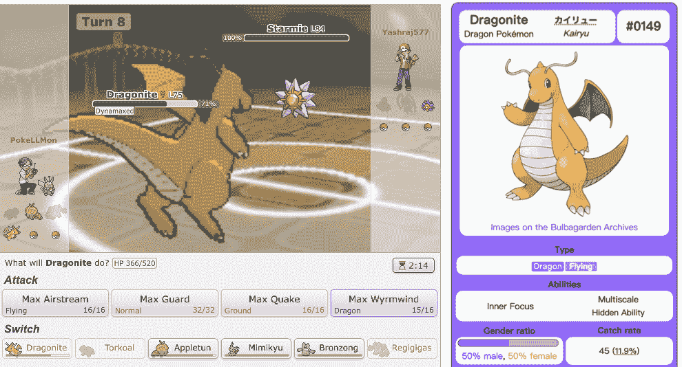
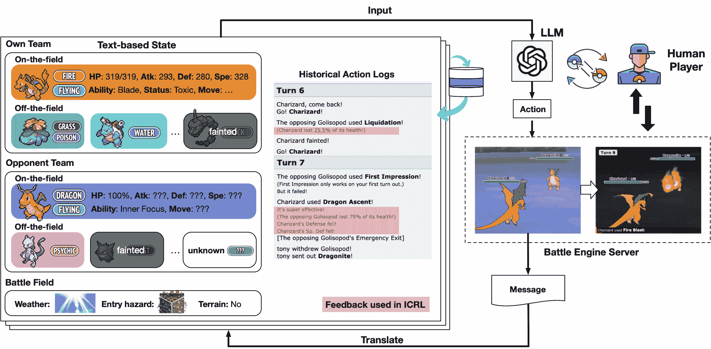
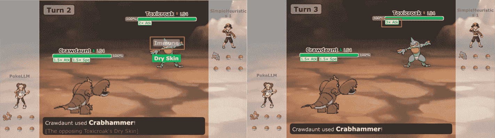
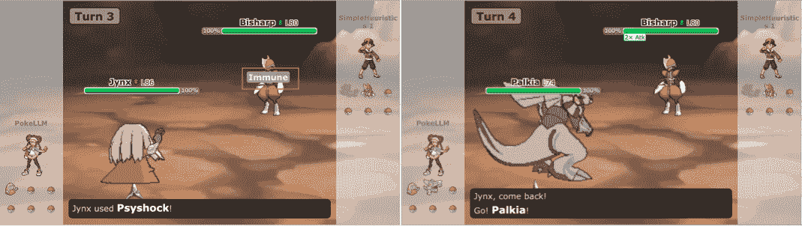
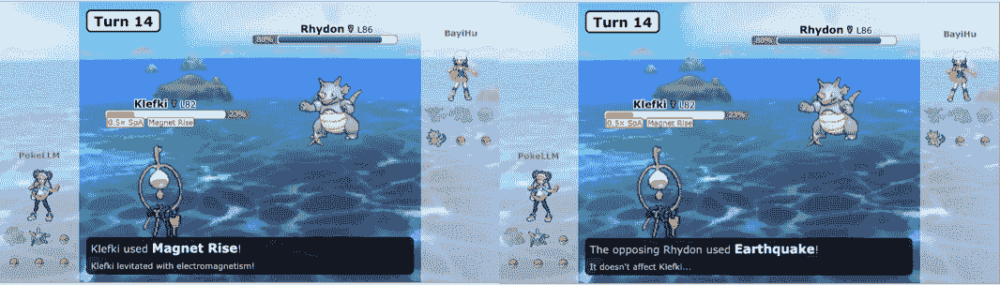
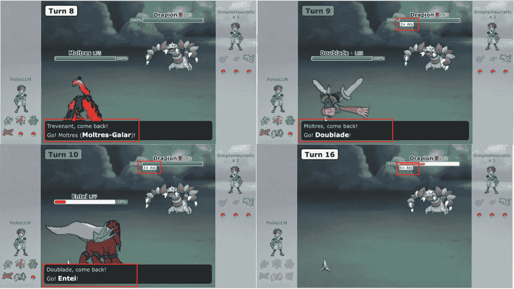
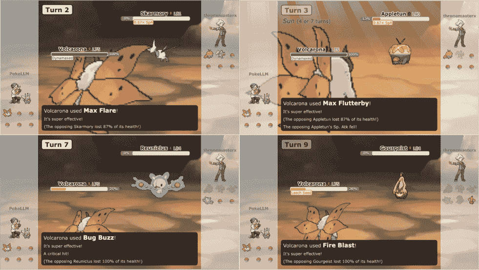
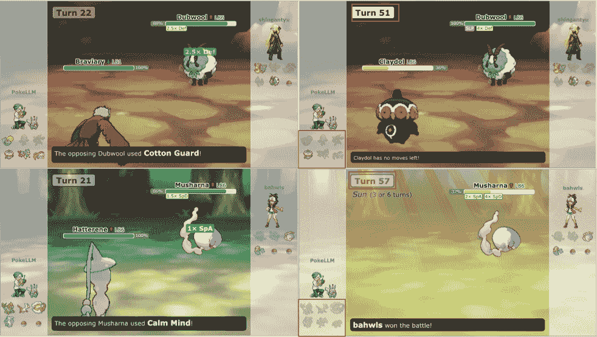
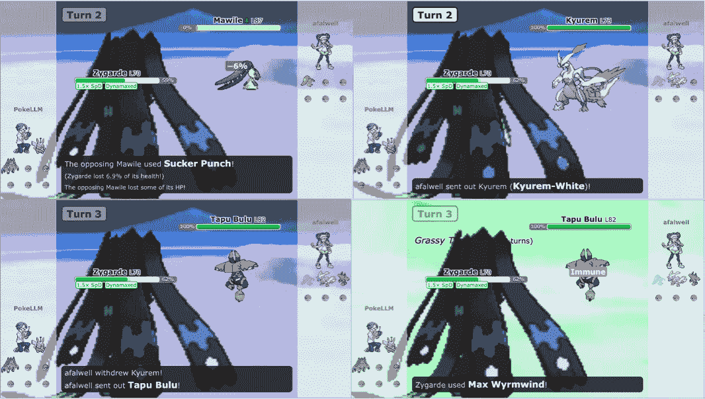

<!--yml
category: 大模型
date: 2022-07-01 00:00:00
-->

# PokéLLMon：一款用于 Pokémon 战斗的基于大型语言模型的人类水平代理

arxiv:2402.01118

胡思皓，黄天圣，刘玲

###### 摘要

我们介绍了 PokéLLMon，第一个在战术战斗游戏中达到人类水平表现的基于 LLM 的代理，如在 Pokémon 战斗中展示的那样。PokéLLMon 的设计包括三个关键策略：（i）上下文强化学习，即即时利用从战斗中获取的基于文本的反馈来迭代地完善策略；（ii）知识增强生成，检索外部知识以抵消幻觉并使代理能够及时和正确地行动；（iii）一致的行动生成，以减轻代理面对强大对手并想要躲避战斗时出现的惊慌切换现象。我们展示了与人类进行的在线战斗表明了 PokéLLMon 的类人战略和及时决策能力，赢得了梯队比赛中的 49% 胜率和邀请赛中的 56% 胜率。我们的实现和可玩的战斗日志可在以下网址找到：[`github.com/git-disl/PokeLLMon`](https://github.com/git-disl/PokeLLMon)。

机器学习，ICML

乔治亚理工学院

美国 亚特兰大 30332

{sihaohu, thuang, ling.liu}@gatech.edu

[`poke-llm-on.github.io/`](https://poke-llm-on.github.io/)

## 1 引言

生成式人工智能和大型语言模型（LLMs）在自然语言处理任务上取得了前所未有的成功（欧阳等人，[2022](https://arxiv.org/html/2402.01118v3#bib.bib24)；Brown 等人，[2020](https://arxiv.org/html/2402.01118v3#bib.bib10)；Xi 等人，[2023](https://arxiv.org/html/2402.01118v3#bib.bib41)；Wang 等人，[2023b](https://arxiv.org/html/2402.01118v3#bib.bib36)）。即将到来的进展之一将是探索 LLMs 如何在物理世界中自主行动，将生成空间从文本扩展到行动，这代表了人工通用智能追求中的一个关键范式（Goertzel＆Pennachin，[2007](https://arxiv.org/html/2402.01118v3#bib.bib14)；Goertzel，[2014](https://arxiv.org/html/2402.01118v3#bib.bib13)）。

游戏是开发基于 LLM 的代理的合适测试平台（Duan 等人，[2022](https://arxiv.org/html/2402.01118v3#bib.bib12)；Batra 等人，[2020](https://arxiv.org/html/2402.01118v3#bib.bib8)），这些代理以一种类似于人类行为的方式与虚拟环境进行交互。例如，生成式代理（Park 等人，[2023](https://arxiv.org/html/2402.01118v3#bib.bib25)）在类似于“模拟人生”的沙盒中进行社会实验，代理扮演各种角色，展示出与人类相似的行为和社交互动。在《我的世界》中，决策代理（Wang 等人，[2023a](https://arxiv.org/html/2402.01118v3#bib.bib35)，[c](https://arxiv.org/html/2402.01118v3#bib.bib38)；Singh 等人，[2023](https://arxiv.org/html/2402.01118v3#bib.bib33)）被设计用于探索世界并发展解决任务和制作工具的新技能。



图 1：在每一轮中，玩家被要求决定执行哪个动作，即是否让快龙行动还是换成场外的另一个宝可梦。

与现有游戏相比，战术战斗游戏（马等，[2023](https://arxiv.org/html/2402.01118v3#bib.bib22)）更适合用于评估 LLMs 的游戏能力，因为胜率可以直接测量，而且始终可以获得一致的对手，如 AI 或人类玩家。作为评估训练师战斗能力的机制，宝可梦战斗在众所周知的宝可梦游戏中具有几个独特优势，是 LLMs 玩战术战斗游戏的第一次尝试：

(1) 状态和动作空间是离散的，可以无损地转换为文本。图[1](https://arxiv.org/html/2402.01118v3#S1.F1 "Figure 1 ‣ 1 Introduction ‣ PokéLLMon: A Human-Parity Agent for Pokémon Battles with Large Language Models")是宝可梦战斗的一个示例：在每一轮中，玩家被要求根据每一方宝可梦的当前状态生成要执行的动作。动作空间包括四种动作和五种可能的宝可梦转换；(2) 基于回合的格式消除了对密集游戏的需求，减轻了 LLMs 的推理时间成本压力，使性能仅依赖于 LLMs 的推理能力；(3) 尽管其看似简单的机制，宝可梦战斗是战略性和复杂性的：经验丰富的玩家考虑了各种因素，包括场上和场外所有宝可梦的物种/类型/能力/状态/物品/动作。在随机战斗中，每个宝可梦是从具有不同特征的大候选池（超过 1,000 个）中随机选择的，要求玩家具有宝可梦知识和推理能力。

范围与贡献：本文的范围是开发一个基于 LLM 的代理人，模仿人类玩家参与宝可梦战斗的方式。目标是探索使基于 LLM 的代理成为优秀玩家的关键因素，并检查其在与人类玩家的战斗中的优势和劣势。为了使 LLMs 能够自主地玩游戏，我们实现了一个可以解析和将战斗状态转换为文本描述，并将生成的动作发送回服务器的环境。通过评估现有的 LLMs，我们确定了幻觉存在和惊慌换人现象的存在。

幻觉：代理可能会错误地发送出在类型上处于劣势的 Pokémon，或者坚持使用对手无效的招式。结果，最先进的 LLM，GPT-4，在与启发式机器人对战时，获胜率为 26%，而人类玩家的获胜率为 60%。为了对抗幻觉，我们提出了两种策略：（1）上下文强化学习：我们立即从战斗中提供基于文本的反馈给代理，作为一种新形式的“奖励”，以迭代地优化行动生成策略，而无需训练；（2）知识增强生成：我们为代理配备了 Pokédex，这是 Pokémon 游戏中的一本百科全书，提供外部知识，如类型优势关系或招式/能力描述，模拟人类玩家搜索陌生 Pokémon 信息的过程。

恐慌性切换：我们发现，当代理遇到强大的 Pokémon 时，它倾向于恐慌，并生成不一致的动作，例如在连续的回合中切换不同的 Pokémon 来逃避战斗，这种现象在具有思维链推理的情况下尤为明显。一致的行动生成通过投票来排除最一致的动作而不过度思考，从而减轻了这个问题。这一观察结果反映了人类的行为，在紧张的情况下，过度思考和夸大困难可能导致恐慌并阻碍行动。

在线战斗展示了 PokéLLMon 的人类竞技战斗能力：它在阶梯比赛中取得了 49%的胜率，在邀请的战斗中取得了 56%的胜率。此外，我们揭示了它对人类玩家的消耗策略和欺骗技巧的脆弱性。

总之，本文提出了四个原创贡献：

+   •

    我们实现并发布了一个环境，使 LLMs 能够自主进行 Pokémon 战斗。

+   •

    我们提出上下文强化学习，以立即和迭代地优化政策，并提出知识增强生成来对抗幻觉。

+   •

    我们发现，当代理在面对强大的对手时，具有思维链经验的代理会感到恐慌，并且一致的行动生成可以缓解这个问题。

+   •

    据我们所知，PokéLLMon 是第一个在战术战斗游戏中具有与人类相当的性能的基于 LLM 的代理。

## 2 个 LLMs 作为游戏玩家

沟通游戏：沟通游戏围绕着玩家之间的沟通、推理，有时还有欺骗。现有研究表明，LLMs 在诸如 Werewolf（Xu 等人，[2023](https://arxiv.org/html/2402.01118v3#bib.bib42)）、Avalane（Light 等人，[2023](https://arxiv.org/html/2402.01118v3#bib.bib21)）、WorldWar II（Hua 等人，[2023](https://arxiv.org/html/2402.01118v3#bib.bib19)）和 Diplomacy（Bakhtin 等人，[2022](https://arxiv.org/html/2402.01118v3#bib.bib7)）等棋盘游戏中展示了战略行为。

开放式游戏：开放式游戏允许玩家自由探索游戏世界并与他人互动。生成代理（Park et al., [2023](https://arxiv.org/html/2402.01118v3#bib.bib25)）展示了基于 LLM 的代理展示出与人类类似的行为和社交模式。在 MineCraft 中，Voyager（Wang et al., [2023a](https://arxiv.org/html/2402.01118v3#bib.bib35)）采用课程机制探索世界，并生成并执行解决任务的代码。DEPS（Wang et al., [2023c](https://arxiv.org/html/2402.01118v3#bib.bib38)）提出了一种“描述、解释、计划和选择”的方法来完成 70 多个任务。像 AutoGPT（[Significant Gravitas,](https://arxiv.org/html/2402.01118v3#bib.bib32)）和 MetaGPT（Hong et al., [2023](https://arxiv.org/html/2402.01118v3#bib.bib17)）这样的基于计划的框架也可以用于探索任务。

战术战斗游戏：在各种游戏类型中，战术战斗游戏（Akata et al., [2023](https://arxiv.org/html/2402.01118v3#bib.bib6); Ma et al., [2023](https://arxiv.org/html/2402.01118v3#bib.bib22)）特别适合用于评估 LLM 的游戏能力，因为可以直接测量胜率，并且总是有固定的对手可供挑战。最近，LLM 被应用于与内置 AI 使用基于文本的界面和摘要链方法对抗 StarCraft II（Ma et al., [2023](https://arxiv.org/html/2402.01118v3#bib.bib22)）。相比之下，PokéLLMon 具有几个优势：（1）将宝可梦战斗状态转换为文本是无损的；（2）回合制格式消除了实时应力，考虑到 LLM 的推理时间成本；（3）与纪律严明的人类玩家对战使得难度大大提升。

## 3 Background

### 3.1 Pokémon

物种：有超过 1000 种宝可梦物种（bul, [2024c](https://arxiv.org/html/2402.01118v3#bib.bib3)），每种都有其独特的能力、属性、统计数据（stats）和战斗招式。图[2](https://arxiv.org/html/2402.01118v3#S3.F2 "Figure 2 ‣ 3.1 Pokémon ‣ 3 Background ‣ PokéLLMon: A Human-Parity Agent for Pokémon Battles with Large Language Models")展示了两个典型的宝可梦：喷火龙和妙蛙种子。

类型：每种宝可梦都有最多两种元素类型，这些类型决定了其优势和弱点。图[3](https://arxiv.org/html/2402.01118v3#S3.F3 "Figure 3 ‣ 3.2 Battle Rule ‣ 3 Background ‣ PokéLLMon: A Human-Parity Agent for Pokémon Battles with Large Language Models")展示了 18 种攻击招式与被攻击宝可梦之间的优势/弱点关系。例如，喷火龙的“火焰冲击”这种火属性招式可以对草属性宝可梦如妙蛙种子造成双倍伤害，而喷火龙本身对水属性招式很脆弱。

Stats: 属性决定宝可梦在战斗中的表现。有四种属性：（1）生命值（HP）：决定宝可梦在晕倒之前能承受的伤害；（2）攻击力（Atk）：影响攻击技能的强度；（3）防御力（Def）：决定抵抗攻击的能力；（4）速度（Spe）：决定战斗中行动顺序。

Ability: 能力是影响战斗的被动效果。例如，喷火龙的能力是“猛火”，在其生命值较低时增强其火属性技能的威力。


Figure 2: 两个代表性宝可梦：喷火龙和妙蛙花。每个宝可梦都有属性、能力、状态和四种战斗技能。

Move: 一个宝可梦可以学习四种战斗技能，分为攻击技能或状态技能。攻击技能具有力量值和命中率，可以造成即时伤害，并与特定属性相关联，通常与宝可梦的属性相关但不一定完全一致；状态技能不会造成即时伤害，但可以通过各种方式影响战斗，如改变属性、治疗或保护宝可梦，或改变战斗环境等。总共有 919 种技能，具有独特的效果（bul, [2024b](https://arxiv.org/html/2402.01118v3#bib.bib2))。

### 3.2 战斗规则

在一对一的随机战斗中（维基百科，[2023](https://arxiv.org/html/2402.01118v3#bib.bib40)），两名战斗者面对面，每人随机选择六只宝可梦。初始阶段，每名战斗者各派出一只宝可梦上场，其余宝可梦留在后备队中以备未来的换阶段。目标是使所有对手的宝可梦晕倒（将其生命值降至零），同时确保自己至少有一只宝可梦未晕倒。战斗是回合制的：每回合开始时，双方玩家选择要执行的动作。动作分为两类：（1）发动技能，或（2）换上另一只宝可梦。战斗引擎执行动作并更新下一步的战斗状态。如果一只宝可梦在回合后晕倒，并且战斗者还有其他未晕倒的宝可梦，战斗引擎将强制换上一只宝可梦，此举不计入玩家的下一步动作。强制换阶段后，玩家仍可选择发动技能或进行另一次换阶段。


图 3：类型优势/劣势关系。“<math alttext="+" class="ltx_Math" display="inline" id="S3.F3.4.m1.1"><semantics id="S3.F3.4.m1.1b"><mo id="S3.F3.4.m1.1.1" xref="S3.F3.4.m1.1.1.cmml">+</mo><annotation encoding="application/x-tex" id="S3.F3.4.m1.1d">+</annotation><annotation encoding="application/x-llamapun" id="S3.F3.4.m1.1e">+</annotation></semantics></math>”表示超有效（2 倍伤害）；“<math alttext="-" class="ltx_Math" display="inline" id="S3.F3.5.m2.1"><semantics id="S3.F3.5.m2.1b"><mo id="S3.F3.5.m2.1.1" xref="S3.F3.5.m2.1.1.cmml">−</mo><annotation encoding="application/x-tex" id="S3.F3.5.m2.1d">-</annotation><annotation encoding="application/x-llamapun" id="S3.F3.5.m2.1e">-</annotation></semantics></math>”表示无效（0.5 倍伤害）；“<math alttext="\times" class="ltx_Math" display="inline" id="S3.F3.6.m3.1"><semantics id="S3.F3.6.m3.1b"><mo id="S3.F3.6.m3.1.1" xref="S3.F3.6.m3.1.1.cmml">×</mo><annotation encoding="application/x-tex" id="S3.F3.6.m3.1d">\times</annotation><annotation encoding="application/x-llamapun" id="S3.F3.6.m3.1e">×</annotation></semantics></math>”表示无效（0 倍伤害）。未标记的为标准（1 倍）伤害。

## 4 战斗环境



图 4：使 LLMs 能够与人类玩家进行战斗的框架：它解析从战斗服务器接收的消息，并将状态日志转换为文本。LLMs 将这些状态描述和历史回合日志作为输入，并生成下一步的动作。然后将该动作发送到战斗服务器，并与对手玩家选择的动作一起执行。

战斗引擎：环境与名为 Pokémon showdown（pok，[2024](https://arxiv.org/html/2402.01118v3#bib.bib4)）的战斗引擎服务器交互，为人类玩家提供基于 Web 的 GUI，并提供与定义格式消息交互的 Web API。

战斗环境：我们实现了一个基于（Sahovic，[2023a](https://arxiv.org/html/2402.01118v3#bib.bib28)）的战斗环境，以支持 LLM 自主进行宝可梦对战。图[4](https://arxiv.org/html/2402.01118v3#S4.F4 "Figure 4 ‣ 4 Battle Environment ‣ PokéLLMon: A Human-Parity Agent for Pokémon Battles with Large Language Models")说明了整个框架的工作方式。在每个回合的开始，环境从服务器接收一个行动请求消息，包括上一回合的执行结果。环境首先解析消息并更新本地状态变量，然后将状态变量转换为文本。文本描述主要包括四个部分：（1）本方队伍信息，包括场上和场外宝可梦的属性；（2）对方队伍信息，包括场上和场外对手宝可梦的属性（有些未知）；（3）战场信息，如天气、进入危害和地形；（4）历史回合日志信息，包括双方宝可梦的先前行动，存储在日志队列中。LLM 将翻译后的状态作为输入，并输出下一步的行动。该行动发送到服务器，并与人类玩家选择的行动一起执行。

## 5 初步评估

为了深入了解宝可梦对战中的挑战，我们评估了现有 LLM 的能力，包括 GPT-3.5（Ouyang 等，[2022](https://arxiv.org/html/2402.01118v3#bib.bib24)）、GPT-4（Achiam 等，[2023](https://arxiv.org/html/2402.01118v3#bib.bib5)）和 LLaMA-2（Touvron 等，[2023](https://arxiv.org/html/2402.01118v3#bib.bib34)）。

### 5.1 宝可梦对战

将 LLM 直接与人类玩家对战非常耗时，因为人类需要时间来思考（平均每场战斗 4 分钟）。为节省时间，我们采用启发式机器人（Sahovic，[2023b](https://arxiv.org/html/2402.01118v3#bib.bib29)）首先在梯队比赛中与人类玩家对战，然后用该机器人来评估现有的 LLM。该机器人被程序化为使用状态提升技能、设置进入危害、通过考虑宝可梦的统计数据、招式的威力和属性优劣来选择最有效的行动。

表 1：LLM 在与机器人对战中的表现。

| 玩家 | 获胜率 <math alttext="\uparrow" class="ltx_Math" display="inline" id="S5.T1.1.1.1.1.m1.1"><semantics id="S5.T1.1.1.1.1.m1.1a"><mo id="S5.T1.1.1.1.1.m1.1.1" stretchy="false" xref="S5.T1.1.1.1.1.m1.1.1.cmml">↑</mo><annotation-xml encoding="MathML-Content" id="S5.T1.1.1.1.1.m1.1b"><ci id="S5.T1.1.1.1.1.m1.1.1.cmml" xref="S5.T1.1.1.1.1.m1.1.1">↑</ci></annotation-xml><annotation encoding="application/x-tex" id="S5.T1.1.1.1.1.m1.1c">\uparrow</annotation><annotation encoding="application/x-llamapun" id="S5.T1.1.1.1.1.m1.1d">↑</annotation></semantics></math> | 得分 <math alttext="\uparrow" class="ltx_Math" display="inline" id="S5.T1.2.2.2.1.m1.1"><semantics id="S5.T1.2.2.2.1.m1.1a"><mo id="S5.T1.2.2.2.1.m1.1.1" stretchy="false" xref="S5.T1.2.2.2.1.m1.1.1.cmml">↑</mo><annotation-xml encoding="MathML-Content" id="S5.T1.2.2.2.1.m1.1b"><ci id="S5.T1.2.2.2.1.m1.1.1.cmml" xref="S5.T1.2.2.2.1.m1.1.1">↑</ci></annotation-xml><annotation encoding="application/x-tex" id="S5.T1.2.2.2.1.m1.1c">\uparrow</annotation><annotation encoding="application/x-llamapun" id="S5.T1.2.2.2.1.m1.1d">↑</annotation></semantics></math> | 回合数 | 战斗数 |
| --- | --- | --- | --- | --- |
| 人类 | 59.84% | 6.75 | 18.74 | 254 |
| Random | 1.2% | 2.34 | 22.37 | 200 |
| MaxPower | 10.40% | 3.79 | 18.11 | 200 |
| LLaMA-2 | 8.00% | 3.47 | 20.98 | 200 |
| GPT-3.5 | 4.00% | 2.61 | 20.09 | 100 |
| GPT-4 | 26.00% | 4.65 | 19.46 | 100 |

统计结果见表 [1](https://arxiv.org/html/2402.01118v3#S5.T1 "表 1 ‣ 5.1 Pokémon Battles ‣ 5 Preliminary Evaluation ‣ PokéLLMon: A Human-Parity Agent for Pokémon Battles with Large Language Models")，其中战斗得分定义为战斗结束时对手已倒下的宝可梦数量和玩家未倒下的宝可梦数量之和。因此，对手玩家的战斗得分等于 12 减去玩家的战斗得分。随机是一种简单的策略，每次都随机生成一个动作，而 MaxPower 则选择具有最高攻击力值的动作。显然，GPT-3.5 和 LLaMA-2 略优于随机策略，甚至 GPT-4 也无法击败这个机器人，更不用说来自梯队比赛的训练有素的人类玩家了。

通过观察 LLM 进行战斗并分析其行为生成的解释，我们发现了幻觉的发生（Rawte 等，[2023](https://arxiv.org/html/2402.01118v3#bib.bib27); Cabello 等，[2023](https://arxiv.org/html/2402.01118v3#bib.bib11)）：LLM 可能会错误地宣称不存在的属性优势关系，甚至更糟糕的是，颠倒属性间的优势关系，比如派遣草属性的宝可梦去面对火属性的宝可梦。在宝可梦战斗中清楚地理解属性优势和劣势至关重要，选择具有属性优势的宝可梦可以造成更多伤害并且遭受更少伤害。

### 5.2 幻觉测试

为了评估 LLM 输出中的幻觉，我们构建了类型优势/劣势预测任务。该任务涉及要求 LLM 确定某种类型的攻击是否 A. 超有效 (2 倍伤害)，B. 标准 (1 倍伤害)，C. 无效 (0.5 倍伤害) 或 D. 无效果 (0 倍伤害) 对某种类型的宝可梦。基于图 [3](https://arxiv.org/html/2402.01118v3#S3.F3 "图 3 ‣ 3.2 战斗规则 ‣ 3 背景 ‣ PokéLLMon: 与大型语言模型一致的宝可梦战斗代理") 构造了 324 (18x18) 测试对。

表 2: 类型优势预测的混淆矩阵。

| 模型 | LLaMA-2 | GPT-3.5 | GPT-4 |
| --- | --- | --- | --- |
| 类别 | A | B | C | D | A | B | C | D | A | B | C | D |
| --- | --- | --- | --- | --- | --- | --- | --- | --- | --- | --- | --- | --- |
| A | 5 | 46 | 0 | 0 | 0 | 0 | 49 | 2 | 37 | 8 | 5 | 1 |
| B | 25 | 179 | 0 | 0 | 2 | 6 | 185 | 11 | 0 | 185 | 17 | 2 |
| C | 15 | 46 | 0 | 0 | 0 | 2 | 57 | 2 | 3 | 24 | 32 | 2 |
| D | 1 | 7 | 0 | 0 | 0 | 0 | 7 | 1 | 0 | 0 | 0 | 8 |

表 [2](https://arxiv.org/html/2402.01118v3#S5.T2 "表 2 ‣ 5.2 幻觉测试 ‣ 5 初步评估 ‣ PokéLLMon: 与大型语言模型一致的宝可梦战斗代理") 显示了 LLM 的三个混淆矩阵，其中它们的表现与它们在表 [1](https://arxiv.org/html/2402.01118v3#S5.T1 "表 1 ‣ 5.1 宝可梦战斗 ‣ 5 初步评估 ‣ PokéLLMon: 与大型语言模型一致的宝可梦战斗代理") 中的胜率密切相关。 LLaMA-2 和 GPT-3.5 遭受严重的幻觉问题，而 GPT-4 实现了最佳性能，准确率为 84.0%，但我们仍然经常观察到它执行无效的动作，这是因为在单场战斗中，LLM 需要比较所有对手的宝可梦的类型与所有自己的宝可梦的类型，以及招式的类型。

## 6 PokéLLMon

概述：PokéLLMon 的总体框架如图 [5](https://arxiv.org/html/2402.01118v3#S6.F5 "图 5 ‣ 6 PokéLLMon ‣ PokéLLMon: 与大型语言模型一致的宝可梦战斗代理") 所示。在每个回合中，PokéLLMon 使用先前的动作和相应的基于文本的反馈来迭代地优化策略，并通过外部知识增加当前状态信息，例如类型优势/劣势关系和招式/特性效果。给定以上信息作为输入，它独立生成多个动作，并选择最一致的动作作为执行的最终输出。


图 5: PokéLLMon 配备了三种策略：(1) ICRL 利用战斗中的即时反馈来迭代地优化生成；(2) KAG 检索外部知识以对抗幻觉并及时和适当地行动；(3) 一致的行动生成以防止紧急切换问题。

### 6.1 在上下文强化学习 (ICRL)

人类玩家的决策不仅基于当前状态，还基于先前动作的（隐含）反馈，例如通过攻击招式攻击宝可梦后两个连续回合内 HP 的变化。如果没有提供反馈，代理可能会持续执行相同的错误动作。如图 [6](https://arxiv.org/html/2402.01118v3#S6.F6 "Figure 6 ‣ 6.1 上下文强化学习（ICRL） ‣ 6 PokéLLMon ‣ PokéLLMon：具有大语言模型的宝可梦对战人类水平代理") 所示，代理使用了水属性招式“Crabhammer”攻击对手的毒骷蛙，一只带有“干燥皮肤”能力的宝可梦，能够抵消水属性招式的伤害。“免疫”消息显示在战斗动画中可以促使人类玩家改变行动，即使不知道“干燥皮肤”的存在，但这一信息没有包含在状态描述中。因此，代理重复执行相同动作，无意中给对手两个额外回合，使得毒骷蛙的攻击统计增加三倍，最终导致失败。

强化学习 （Schulman 等，[2017](https://arxiv.org/html/2402.01118v3#bib.bib30); Mnih 等，[2016](https://arxiv.org/html/2402.01118v3#bib.bib23); Hafner 等，[2023](https://arxiv.org/html/2402.01118v3#bib.bib16)）需要数值奖励来评估行动以优化策略。由于大语言模型能够理解语言并区分好坏，文本反馈描述提供了一种新形式的“奖励”。通过将先前回合的文本反馈融入上下文，代理能够在服务期间迭代并即时地优化其“策略”，即上下文强化学习（ICRL）。

在实践中，我们生成四种类型的反馈：（1）HP 在两个连续回合中的变化，反映了攻击招式造成的实际伤害；（2）攻击招式的效果，指示其是否因类型优势或能力/招式效果而产生超有效、无效或无效果（免疫）；（3）招式执行的优先级，提供了对速度的粗略估计，因为对手宝可梦的详细统计数据不可用；（4）执行招式的实际效果：状态和某些攻击招式可能导致诸如属性提升或降低、恢复 HP、施加中毒、灼伤或冰冻等结果。图 [4](https://arxiv.org/html/2402.01118v3#S4.F4 "Figure 4 ‣ 4 战斗环境 ‣ PokéLLMon：具有大语言模型的宝可梦对战人类水平代理") 展示了 ICLR 为 ICLR 生成的几个文本反馈实例。



图 6：代理反复使用相同攻击招式，但由于对手宝可梦的“干燥皮肤”能力，对其没有任何效果。



图 7：在第三回合，代理使用了“Psyshock”，对对手的宝可梦造成零伤害。使用 ICRL 后，代理换到了另一个宝可梦。

表 3：ICRL 在与机器人对战中的表现。

| 玩家 | 胜率 <math alttext="\uparrow" class="ltx_Math" display="inline" id="S6.T3.1.1.1.1.m1.1"><semantics id="S6.T3.1.1.1.1.m1.1a"><mo id="S6.T3.1.1.1.1.m1.1.1" stretchy="false" xref="S6.T3.1.1.1.1.m1.1.1.cmml">↑</mo><annotation-xml encoding="MathML-Content" id="S6.T3.1.1.1.1.m1.1b"><ci id="S6.T3.1.1.1.1.m1.1.1.cmml" xref="S6.T3.1.1.1.1.m1.1.1">↑</ci></annotation-xml><annotation encoding="application/x-tex" id="S6.T3.1.1.1.1.m1.1c">\uparrow</annotation><annotation encoding="application/x-llamapun" id="S6.T3.1.1.1.1.m1.1d">↑</annotation></semantics></math> | 分数 <math alttext="\uparrow" class="ltx_Math" display="inline" id="S6.T3.2.2.2.1.m1.1"><semantics id="S6.T3.2.2.2.1.m1.1a"><mo id="S6.T3.2.2.2.1.m1.1.1" stretchy="false" xref="S6.T3.2.2.2.1.m1.1.1.cmml">↑</mo><annotation-xml encoding="MathML-Content" id="S6.T3.2.2.2.1.m1.1b"><ci id="S6.T3.2.2.2.1.m1.1.1.cmml" xref="S6.T3.2.2.2.1.m1.1.1">↑</ci></annotation-xml><annotation encoding="application/x-tex" id="S6.T3.2.2.2.1.m1.1c">\uparrow</annotation><annotation encoding="application/x-llamapun" id="S6.T3.2.2.2.1.m1.1d">↑</annotation></semantics></math> | 回合数 | 战斗次数 |
| --- | --- | --- | --- | --- |
| 人类 | 59.84% | 6.75 | 18.74 | 254 |
| 原始 | 26.00% | 4.65 | 19.46 | 100 |
| ICRL | 36.00% | 5.25 | 20.64 | 100 |

表[3](https://arxiv.org/html/2402.01118v3#S6.T3 "Table 3 ‣ 6.1 In-Context Reinforcement Learning (ICRL) ‣ 6 PokéLLMon ‣ PokéLLMon: A Human-Parity Agent for Pokémon Battles with Large Language Models")显示了 ICRL 带来的改善。与 GPT-4 的原始表现相比，胜率提高了 10％，战斗分数增加了 12.9％。在对战过程中，我们观察到，如果先前回合的动作不符合预期，代理人会开始改变其行动，如图[7](https://arxiv.org/html/2402.01118v3#S6.F7 "Figure 7 ‣ 6.1 In-Context Reinforcement Learning (ICRL) ‣ 6 PokéLLMon ‣ PokéLLMon: A Human-Parity Agent for Pokémon Battles with Large Language Models")所示：在观察到对方宝可梦对攻击免疫后，它会切换到另一只宝可梦。

### 6.2 知识增强生成（KAG）

尽管 ICRL 能够减轻幻觉的影响，但在接收到反馈之前，它仍然可能造成致命后果。例如，如果代理人对战时出动了一只草系宝可梦对抗火系宝可梦，前者很可能会在对战的一回合内被击败，直到代理人意识到这是一个错误的决定。为了进一步减少幻觉，检索增强生成（Lewis 等人，[2020](https://arxiv.org/html/2402.01118v3#bib.bib20)；Guu 等人，[2020](https://arxiv.org/html/2402.01118v3#bib.bib15)；Patil 等人，[2023](https://arxiv.org/html/2402.01118v3#bib.bib26)）利用外部知识来增强生成。在本节中，我们介绍了两种基本减轻幻觉的外部知识类型。

类型优势/劣势关系：在图 [4](https://arxiv.org/html/2402.01118v3#S4.F4 "图 4 ‣ 4 战斗环境 ‣ PokéLLMon：具有大型语言模型的 Pokémon 战斗的人类同等代理")中的原始状态描述中，我们注释了所有 Pokémon 和招式的类型信息，以便代理自行推断类型优势关系。为了减少推理中的幻觉，我们明确注释了对手 Pokémon 和我们的 Pokémon 的类型优势和劣势，例如“喷火龙对草属性 Pokémon 有优势，但对火属性招式有劣势”。

表格 4：KAG 在与机器人对战中的表现。

| 玩家 | 获胜率 <math alttext="\uparrow" class="ltx_Math" display="inline" id="S6.T4.1.1.1.1.m1.1"><semantics id="S6.T4.1.1.1.1.m1.1a"><mo id="S6.T4.1.1.1.1.m1.1.1" stretchy="false" xref="S6.T4.1.1.1.1.m1.1.1.cmml">↑</mo><annotation-xml encoding="MathML-Content" id="S6.T4.1.1.1.1.m1.1b"><ci id="S6.T4.1.1.1.1.m1.1.1.cmml" xref="S6.T4.1.1.1.1.m1.1.1">↑</ci></annotation-xml><annotation encoding="application/x-tex" id="S6.T4.1.1.1.1.m1.1c">\uparrow</annotation><annotation encoding="application/x-llamapun" id="S6.T4.1.1.1.1.m1.1d">↑</annotation></semantics></math> | 得分 <math alttext="\uparrow" class="ltx_Math" display="inline" id="S6.T4.2.2.2.1.m1.1"><semantics id="S6.T4.2.2.2.1.m1.1a"><mo id="S6.T4.2.2.2.1.m1.1.1" stretchy="false" xref="S6.T4.2.2.2.1.m1.1.1.cmml">↑</mo><annotation-xml encoding="MathML-Content" id="S6.T4.2.2.2.1.m1.1b"><ci id="S6.T4.2.2.2.1.m1.1.1.cmml" xref="S6.T4.2.2.2.1.m1.1.1">↑</ci></annotation-xml><annotation encoding="application/x-tex" id="S6.T4.2.2.2.1.m1.1c">\uparrow</annotation><annotation encoding="application/x-llamapun" id="S6.T4.2.2.2.1.m1.1d">↑</annotation></semantics></math> | 回合数 | 战斗数 |
| --- | --- | --- | --- | --- |
| 人类 | 59.84% | 6.75 | 18.74 | 254 |
| 原始 | 36.00% | 5.25 | 20.64 | 100 |
| KAG[类型] | 55.00% | 6.09 | 19.28 | 100 |
| KAG[效果] | 40.00% | 5.64 | 20.73 | 100 |
| KAG | 58.00% | 6.53 | 18.84 | 100 |



图 8：代理理解了移动效果并正确使用：卡钥匙容易受到雷丹的地面类型攻击的伤害。代理不选择交换，而是使用“磁浮”，这个招式可以在五个回合内保护自己免受地面类型攻击的伤害，使对方雷丹的地面类型攻击“地震”无效。

招式/能力效果：鉴于拥有各种各样具有不同效果的招式和能力，即使是经验丰富的人类玩家也很难记住所有这些。例如，仅根据其名称推断状态招式的效果是困难的：“龙之舞”可以提升使用者的攻击和速度一级，而“烟雾”可以重置双方 Pokémon 的提升状态并清除像烧伤这样的异常状态。即使是攻击招式也可能除了造成伤害外还有其他效果。

我们从 Bulbapedia（bul，[2024b](https://arxiv.org/html/2402.01118v3#bib.bib2)，[a](https://arxiv.org/html/2402.01118v3#bib.bib1)）收集了所有招式和特性的效果描述，并将它们存储到 Pokédex 中，这是《宝可梦》游戏中的一本百科全书。对于战场上的每只宝可梦，它的特性效果和招式效果都从 Pokédex 中检索并添加到状态描述中。

表格[4](https://arxiv.org/html/2402.01118v3#S6.T4 "Table 4 ‣ 6.2 Knowledge-Augmented Generation (KAG) ‣ 6 PokéLLMon ‣ PokéLLMon: A Human-Parity Agent for Pokémon Battles with Large Language Models")显示了使用两种类型知识增强的生成结果，其中类型优势关系（KAG[Type]）显著提高了胜率，从 36%增至 55%，而招式/特性效果描述也通过 4 个 AP 增强了胜率。结合两者，KAG 在与启发式机器人的对战中实现了 58%的胜率，接近人类水平。

借助外部知识，我们观察到代理开始在适当的时间使用非常特殊的动作。例如，在图[8](https://arxiv.org/html/2402.01118v3#S6.F8 "Figure 8 ‣ 6.2 Knowledge-Augmented Generation (KAG) ‣ 6 PokéLLMon ‣ PokéLLMon: A Human-Parity Agent for Pokémon Battles with Large Language Models")中显示的例子中，一只钢属性的钥圈儿宝可梦（Klefki）对于地属性攻击的对手雷电兽（Rhydon）是脆弱的。通常在这种劣势下，代理会选择切换到另一只宝可梦，然而，它选择使用招式“磁场”，使使用者在五回合内漂浮，从而免疫地属性招式。因此，对手雷电兽的地震招式变得无效。

### 6.3 一致的行动生成

现有研究（Wei 等，[2022](https://arxiv.org/html/2402.01118v3#bib.bib39)；Yao 等，[2022](https://arxiv.org/html/2402.01118v3#bib.bib43)；Shinn 等，[2023](https://arxiv.org/html/2402.01118v3#bib.bib31)；Bommasani 等，[2021](https://arxiv.org/html/2402.01118v3#bib.bib9)；Hu 等，[2023](https://arxiv.org/html/2402.01118v3#bib.bib18)）表明，推理和提示能够提升 LLMs 在解决复杂任务上的能力。我们评估了包括思维链（Wei 等，[2022](https://arxiv.org/html/2402.01118v3#bib.bib39)）（CoT）、自一致性（Wang 等，[2022](https://arxiv.org/html/2402.01118v3#bib.bib37)）（SC）和思维树（Yao 等，[2023](https://arxiv.org/html/2402.01118v3#bib.bib44)）（ToT）在内的现有提示方法。对于 CoT，代理首先生成一个思维，分析当前的战斗情况，并输出一个基于该思维的动作。对于 SC（k=3），代理生成三次动作，选择投票最多的答案作为输出。对于 ToT（k=3），代理生成三个动作选项，并从中选择由自身评估为最佳的一个。

表格 5：在与机器人对战中提示方法的性能。

| 玩家 | 胜率 <math alttext="\uparrow" class="ltx_Math" display="inline" id="S6.T5.1.1.1.1.m1.1"><semantics id="S6.T5.1.1.1.1.m1.1a"><mo id="S6.T5.1.1.1.1.m1.1.1" stretchy="false" xref="S6.T5.1.1.1.1.m1.1.1.cmml">↑</mo><annotation-xml encoding="MathML-Content" id="S6.T5.1.1.1.1.m1.1b"><ci id="S6.T5.1.1.1.1.m1.1.1.cmml" xref="S6.T5.1.1.1.1.m1.1.1">↑</ci></annotation-xml><annotation encoding="application/x-tex" id="S6.T5.1.1.1.1.m1.1c">\uparrow</annotation><annotation encoding="application/x-llamapun" id="S6.T5.1.1.1.1.m1.1d">↑</annotation></semantics></math> | 得分 <math alttext="\uparrow" class="ltx_Math" display="inline" id="S6.T5.2.2.2.1.m1.1"><semantics id="S6.T5.2.2.2.1.m1.1a"><mo id="S6.T5.2.2.2.1.m1.1.1" stretchy="false" xref="S6.T5.2.2.2.1.m1.1.1.cmml">↑</mo><annotation-xml encoding="MathML-Content" id="S6.T5.2.2.2.1.m1.1b"><ci id="S6.T5.2.2.2.1.m1.1.1.cmml" xref="S6.T5.2.2.2.1.m1.1.1">↑</ci></annotation-xml><annotation encoding="application/x-tex" id="S6.T5.2.2.2.1.m1.1c">\uparrow</annotation><annotation encoding="application/x-llamapun" id="S6.T5.2.2.2.1.m1.1d">↑</annotation></semantics></math> | 回合数 | 战斗数 |
| --- | --- | --- | --- | --- |
| 人类 | 59.84% | 6.75 | 18.74 | 254 |
| 原文 | 58.00% | 6.53 | 18.84 | 100 |
| CoT | 54.00% | 5.78 | 19.60 | 100 |
| SC（k=3） | 64.00% | 6.63 | 18.86 | 100 |
| ToT（k=3） | 60.00% | 6.42 | 20.24 | 100 |

表 [5](https://arxiv.org/html/2402.01118v3#S6.T5 "表 5 ‣ 6.3 Consistent Action Generation ‣ 6 PokéLLMon ‣ PokéLLMon：用于 Pokémon 战斗的与人类相当的代理与大型语言模型") 展示了原始 IO 提示生成和三种算法的比较结果。值得注意的是，CoT 导致胜率下降了 6 个 AP。相比之下，SC 带来了性能改善，胜率超过了人类玩家。除了结果外，我们对理解这些观察结果背后的原因更感兴趣。



图 9：当面对强大的 Pokémon 时，具有 CoT 的代理会在连续三次中切换不同的 Pokémon 以躲避战斗。这使得对手有三个免费的回合来四倍增加其攻击统计，并迅速击败代理的整个团队。

如第 [3.2](https://arxiv.org/html/2402.01118v3#S3.SS2 "3.2 Battle Rule ‣ 3 Background ‣ PokéLLMon: A Human-Parity Agent for Pokémon Battles with Large Language Models") 节中所介绍的，每回合只能采取单一行动，这意味着如果代理选择换入，而对手选择攻击，那么换入的神奇宝贝将承受伤害。通常，当代理决定利用未参战神奇宝贝的属性优势时，所承受的伤害是可以承受的，因为换入的神奇宝贝通常对对手神奇宝贝的招式具有抗性。然而，当具有 CoT 推理能力的代理面对强大的对手神奇宝贝时，其行动因连续换入不同神奇宝贝而变得不一致，这就是我们称之为惊慌换入的现象。惊慌换入浪费了采取行动的机会，并导致失败。一个例证性的例子显示在图 [9](https://arxiv.org/html/2402.01118v3#S6.F9 "图 9 ‣ 6.3 Consistent Action Generation ‣ 6 PokéLLMon ‣ PokéLLMon: A Human-Parity Agent for Pokémon Battles with Large Language Models") 中：从第 8 回合开始，代理选择在连续三个回合内不断换入不同的神奇宝贝，使得对手神奇宝贝有三个自由回合来提升其攻击能力四倍，并迅速击败了代理的整个队伍。

表 6：惊慌换入的统计分析

| Player | Win rate <math alttext="\uparrow" class="ltx_Math" display="inline" id="S6.T6.1.1.1.1.m1.1"><semantics id="S6.T6.1.1.1.1.m1.1a"><mo id="S6.T6.1.1.1.1.m1.1.1" stretchy="false" xref="S6.T6.1.1.1.1.m1.1.1.cmml">↑</mo><annotation-xml encoding="MathML-Content" id="S6.T6.1.1.1.1.m1.1b"><ci id="S6.T6.1.1.1.1.m1.1.1.cmml" xref="S6.T6.1.1.1.1.m1.1.1">↑</ci></annotation-xml><annotation encoding="application/x-tex" id="S6.T6.1.1.1.1.m1.1c">\uparrow</annotation><annotation encoding="application/x-llamapun" id="S6.T6.1.1.1.1.m1.1d">↑</annotation></semantics></math> | Switch rate | CS1 rate | CS2 rate |
| --- | --- | --- | --- | --- |
| Origin | 58.00% | 17.05% | 6.21% | 22.98% |
| CoT | 54.00% | 26.15% | 10.77% | 34.23% |
| SC (k=3) | 64.00% | 16.00% | 1.99% | 19.86% |
| ToT (k=3) | 60.00% | 19.70% | 5.88% | 23.08% |

表 [6](https://arxiv.org/html/2402.01118v3#S6.T6 "表 6 ‣ 6.3 Consistent Action Generation ‣ 6 PokéLLMon ‣ PokéLLMon: A Human-Parity Agent for Pokémon Battles with Large Language Models") 提供了统计证据，其中 CS1 表示上一回合行动为换入的比率，而 CS2 比率表示至少有一次行动在最近两回合内是换入的比率，这些行动都是在所有换入行动中的比率。CS1 比率越高，生成的不一致性就越大。显然，CoT 大大增加了连续换入的比率，而 SC 则减少了连续换入的比率。

在检查 CoT 生成的思维时，我们观察到思绪中包含恐慌情绪：代理描述对手宝可梦的强大以及当前宝可梦的弱点，并最终决定切换到另一个宝可梦，如“龙王蝎已将其攻击力提升到两倍，构成了可能一击击倒双剑鞘的重大威胁。由于双剑鞘较慢且可能被击倒，我需要切换到炎帝因为…”。受恐慌思维条件化的行动生成导致代理程序持续切换宝可梦而非进攻。相比之下，通过 SC 进行一致的行动生成多次独立生成行动并淘汰最一致的行动，如图[5](https://arxiv.org/html/2402.01118v3#S6.F5 "Figure 5 ‣ 6 PokéLLMon ‣ PokéLLMon: A Human-Parity Agent for Pokémon Battles with Large Language Models")所示，导致更高的胜率。该观察反映出：当人类面对压力情境时，过度思考和夸大困难会导致恐慌情绪，并使其无法采取行动，从而导致更糟的情况。

## 7 Online Battle

为了测试 PokéLLMon 对抗人类的战斗能力，我们在 Pokémon Showdown 上设置了第八代比赛，代理程序在 2024 年 1 月 25 日至 1 月 26 日为梯队比赛中的随机人类玩家进行战斗。此外，我们还邀请了一名具有超过 15 年宝可梦游戏经验的人类玩家，代表人类玩家的平均能力，与 PokéLLMon 进行对战。

### 7.1 对战人类玩家

Table 7: PokéLLMon 在与人类玩家对战中的表现。

| v.s. 玩家 | 胜率 <math alttext="\uparrow" class="ltx_Math" display="inline" id="S7.T7.1.1.1.1.m1.1"><semantics id="S7.T7.1.1.1.1.m1.1a"><mo id="S7.T7.1.1.1.1.m1.1.1" stretchy="false" xref="S7.T7.1.1.1.1.m1.1.1.cmml">↑</mo><annotation-xml encoding="MathML-Content" id="S7.T7.1.1.1.1.m1.1b"><ci id="S7.T7.1.1.1.1.m1.1.1.cmml" xref="S7.T7.1.1.1.1.m1.1.1">↑</ci></annotation-xml><annotation encoding="application/x-tex" id="S7.T7.1.1.1.1.m1.1c">\uparrow</annotation><annotation encoding="application/x-llamapun" id="S7.T7.1.1.1.1.m1.1d">↑</annotation></semantics></math> | 得分 <math alttext="\uparrow" class="ltx_Math" display="inline" id="S7.T7.2.2.2.1.m1.1"><semantics id="S7.T7.2.2.2.1.m1.1a"><mo id="S7.T7.2.2.2.1.m1.1.1" stretchy="false" xref="S7.T7.2.2.2.1.m1.1.1.cmml">↑</mo><annotation-xml encoding="MathML-Content" id="S7.T7.2.2.2.1.m1.1b"><ci id="S7.T7.2.2.2.1.m1.1.1.cmml" xref="S7.T7.2.2.2.1.m1.1.1">↑</ci></annotation-xml><annotation encoding="application/x-tex" id="S7.T7.2.2.2.1.m1.1c">\uparrow</annotation><annotation encoding="application/x-llamapun" id="S7.T7.2.2.2.1.m1.1d">↑</annotation></semantics></math> | 回合数 | 战斗次数 |
| --- | --- | --- | --- | --- |
| 梯队玩家 | 48.57% | 5.76 | 18.68 | 105 |
| 邀请玩家 | 56.00% | 6.52 | 22.42 | 50 |

表 [7](https://arxiv.org/html/2402.01118v3#S7.T7 "Table 7 ‣ 7.1 Battle Against Human Players ‣ 7 Online Battle ‣ PokéLLMon: A Human-Parity Agent for Pokémon Battles with Large Language Models") 展示了代理程序对抗人类玩家的表现。PokéLLMon 展示了与拥有丰富战斗经验的纪律 Ladder 玩家相媲美的表现，并且比邀请的玩家取得了更高的胜率。在 Ladder 比赛中，平均回合数较低，因为人类玩家有时会在他们认为会输掉比赛时放弃以节省时间。

### 7.2 战斗技能分析



图 10：PokéLLMon 每回合选择有效招式，使用一个 Pokémon 使对手的整个队伍晕倒。

优点：PokéLLMon 很少在选择有效招式和换到另一个合适的 Pokémon 时出错，这归功于 KAG 策略。如图 [10](https://arxiv.org/html/2402.01118v3#S7.F10 "Figure 10 ‣ 7.2 Battle Skill Analysis ‣ 7 Online Battle ‣ PokéLLMon: A Human-Parity Agent for Pokémon Battles with Large Language Models") 所示，在一场战斗中，代理程序仅使用一个 Pokémon 通过选择不同的攻击招式对不同的 Pokémon 造成伤害，导致整个对方队伍晕倒。

此外，PokéLLMon 展示了类似于人类的消耗战略：一些 Pokémon 具有“剧毒”招式，可以每回合造成额外伤害，以及“恢复”招式，可以恢复其 HP，代理程序首先使对方 Pokémon 中毒，并频繁使用“恢复”以防止自己晕倒。通过延长战斗时间，对方 Pokémon 的 HP 逐渐被中毒伤害消耗殆尽。使用消耗战略需要理解招式如“剧毒”、“恢复”和“保护”，以及其正确使用的时机（例如没有类型弱点或者防御力较高时）。可在以下链接找到带有战斗动画的示例：[`poke-llm-on.github.io`](https://poke-llm-on.github.io)。



图 11：PokéLLMon 遭受消耗战略的困扰：对手玩家频繁恢复高防御 Pokémon。打破这一困境需要跨越多个回合的联合效果。

弱点：PokéLLMon 倾向于采取可以实现短期利益的行动，因此容易受到需要长期努力才能打破的人类玩家的消耗战策略的影响。正如图 [11](https://arxiv.org/html/2402.01118v3#S7.F11 "Figure 11 ‣ 7.2 Battle Skill Analysis ‣ 7 Online Battle ‣ PokéLLMon: A Human-Parity Agent for Pokémon Battles with Large Language Models") 中展示的两场战斗，经过多个回合后，代理人的整个队伍被人类玩家的神奇宝贝击败，后者防御大幅提升并频繁恢复。表 [8](https://arxiv.org/html/2402.01118v3#S7.T8 "Table 8 ‣ 7.2 Battle Skill Analysis ‣ 7 Online Battle ‣ PokéLLMon: A Human-Parity Agent for Pokémon Battles with Large Language Models") 报告了 PokéLLMon 在人类玩家是否使用消耗战策略的战斗中的表现。显然，在没有消耗战策略的战斗中，它表现优异，而在人类使用消耗战策略时，大多数战斗都失败了。

表 8：受到消耗战策略影响的战斗表现

| 阶梯 | 获胜率 <math alttext="\uparrow" class="ltx_Math" display="inline" id="S7.T8.1.1.1.1.m1.1"><semantics id="S7.T8.1.1.1.1.m1.1a"><mo id="S7.T8.1.1.1.1.m1.1.1" stretchy="false" xref="S7.T8.1.1.1.1.m1.1.1.cmml">↑</mo><annotation-xml encoding="MathML-Content" id="S7.T8.1.1.1.1.m1.1b"><ci id="S7.T8.1.1.1.1.m1.1.1.cmml" xref="S7.T8.1.1.1.1.m1.1.1">↑</ci></annotation-xml><annotation encoding="application/x-tex" id="S7.T8.1.1.1.1.m1.1c">\uparrow</annotation><annotation encoding="application/x-llamapun" id="S7.T8.1.1.1.1.m1.1d">↑</annotation></semantics></math> | 分数 <math alttext="\uparrow" class="ltx_Math" display="inline" id="S7.T8.2.2.2.1.m1.1"><semantics id="S7.T8.2.2.2.1.m1.1a"><mo id="S7.T8.2.2.2.1.m1.1.1" stretchy="false" xref="S7.T8.2.2.2.1.m1.1.1.cmml">↑</mo><annotation-xml encoding="MathML-Content" id="S7.T8.2.2.2.1.m1.1b"><ci id="S7.T8.2.2.2.1.m1.1.1.cmml" xref="S7.T8.2.2.2.1.m1.1.1">↑</ci></annotation-xml><annotation encoding="application/x-tex" id="S7.T8.2.2.2.1.m1.1c">\uparrow</annotation><annotation encoding="application/x-llamapun" id="S7.T8.2.2.2.1.m1.1d">↑</annotation></semantics></math> | 转数 | 战斗数 |
| --- | --- | --- | --- | --- |
| 带有消耗战 | 18.75% | 4.29 | 33.88 | 16 |
| 不带消耗战 | 53.93% | 6.02 | 15.95 | 89 |

“恢复”招式在一个回合内可以恢复 50% 的 HP，这意味着如果一次攻击不能对敌方神奇宝贝造成超过 50% 的伤害，它将永远不会倒下。打破这一困境的关键是首先提升一个神奇宝贝的攻击到非常高的阶段，然后进行攻击造成不可恢复的伤害，这是一个需要跨多个回合共同努力的长期目标。PokéLLMon 对长期规划的弱点在于当前设计没有在多个时间步长上保持长期计划，这将在未来的工作中包括进去。



图 12：一名经验丰富的人类玩家通过首先派出一只龙系宝可梦，然后立即切换到另一只对龙系攻击免疫的宝可梦，误导代理使用龙系攻击。

最后，我们观察到经验丰富的人类玩家可以误导代理做出错误的行动。如图[12](https://arxiv.org/html/2402.01118v3#S7.F12 "图 12 ‣ 7.2 战斗技能分析 ‣ 7 在线对战 ‣ PokéLLMon：基于大型语言模型的宝可梦对战人类水平代理")所示，我们的基格尔德有一次使用增强攻击招式的机会。在第 2 回合结束时，对方的钢牙已经倒下，导致强制切换，对手选择切换到酋雷姆。这种切换是一个诡计，诱使代理在第 3 回合使用龙系招式，因为酋雷姆对龙系攻击脆弱。在第 3 回合，对手在开局时切换到卡璞鳍鳍，一只对龙系攻击免疫的宝可梦，使我们的增强攻击机会被浪费。代理被愚弄了，因为它只基于当前状态信息做出决策，而经验丰富的玩家不仅基于状态信息，还基于对手的下一步行动预测。

识破技巧并预测对手的下一步行动需要代理在真实战斗环境中保持纪律，这是我们工作的未来步骤。

## 8 结论

在本文中，我们使 LLMs 能够自主地与人类进行著名的宝可梦对战。我们介绍了 PokéLLMon，这是第一个在战术对战游戏中实现人类水平表现的基于 LLM 的代理。我们在 PokéLLMon 的设计中引入了三个关键策略：(i) 上下文强化学习，将基于文本的反馈作为“奖励”来迭代地优化行动生成策略，无需训练；(ii) 知识增强生成，检索外部知识以对抗幻觉，确保代理及时和正确地行动；(iii) 一致的行动生成，避免在遇到强大对手时出现恐慌性切换问题。PokéLLMon 的架构是通用的，可以用于设计许多其他游戏中基于 LLM 的代理，解决幻觉和行动不一致的问题。

在线对战显示，PokéLLMon 展示了类似人类的战斗能力和策略，获得了梯队比赛中 49%的胜率和邀请对战中 56%的胜率。此外，我们揭示了其对人类玩家的消耗策略和欺骗技巧的脆弱性，这被视为我们未来的工作。

## 参考文献

```
*   bul (2024a) List of abilities, 2024a. URL [`bulbapedia.bulbagarden.net/wiki/Ability#List_of_Abilities`](https://bulbapedia.bulbagarden.net/wiki/Ability#List_of_Abilities).
*   bul (2024b) List of moves, 2024b. URL [`bulbapedia.bulbagarden.net/wiki/List_of_moves`](https://bulbapedia.bulbagarden.net/wiki/List_of_moves).
*   bul (2024c) List of pokémon by national pokédex number, 2024c. URL [`bulbapedia.bulbagarden.net/wiki/List_of_Pokémon_by_National_Pokédex_number`](https://bulbapedia.bulbagarden.net/wiki/List_of_Pok%C3%A9mon_by_National_Pok%C3%A9dex_number).
*   pok (2024) Pokémon showdown, 2024. URL [`play.pokemonshowdown.com`](https://play.pokemonshowdown.com).
*   Achiam et al. (2023) Achiam, J., Adler, S., Agarwal, S., Ahmad, L., Akkaya, I., Aleman, F. L., Almeida, D., Altenschmidt, J., Altman, S., Anadkat, S., et al. Gpt-4 technical report. *arXiv preprint arXiv:2303.08774*, 2023.
*   Akata et al. (2023) Akata, E., Schulz, L., Coda-Forno, J., Oh, S. J., Bethge, M., and Schulz, E. Playing repeated games with large language models. *arXiv preprint arXiv:2305.16867*, 2023.
*   Bakhtin et al. (2022) Bakhtin, A., Brown, N., Dinan, E., Farina, G., Flaherty, C., Fried, D., Goff, A., Gray, J., Hu, H., et al. Human-level play in the game of diplomacy by combining language models with strategic reasoning. *Science*, 378(6624):1067–1074, 2022.
*   Batra et al. (2020) Batra, D., Chang, A. X., Chernova, S., Davison, A. J., Deng, J., Koltun, V., Levine, S., Malik, J., Mordatch, I., Mottaghi, R., et al. Rearrangement: A challenge for embodied ai. *arXiv preprint arXiv:2011.01975*, 2020.
*   Bommasani et al. (2021) Bommasani, R., Hudson, D. A., Adeli, E., Altman, R., Arora, S., von Arx, S., Bernstein, M. S., Bohg, J., Bosselut, A., Brunskill, E., et al. On the opportunities and risks of foundation models. *arXiv preprint arXiv:2108.07258*, 2021.
*   Brown et al. (2020) Brown, T., Mann, B., Ryder, N., Subbiah, M., Kaplan, J. D., Dhariwal, P., Neelakantan, A., Shyam, P., Sastry, G., Askell, A., et al. Language models are few-shot learners. *Advances in neural information processing systems*, 33:1877–1901, 2020.
*   Cabello et al. (2023) Cabello, L., Li, J., and Chalkidis, I. Pokemonchat: Auditing chatgpt for pok<math alttext="\backslash" class="ltx_Math" display="inline" id="bib.bib11.1.m1.1"><semantics id="bib.bib11.1.m1.1a"><mo id="bib.bib11.1.m1.1.1" xref="bib.bib11.1.m1.1.1.cmml">\</mo><annotation-xml encoding="MathML-Content" id="bib.bib11.1.m1.1b"><ci id="bib.bib11.1.m1.1.1.cmml" xref="bib.bib11.1.m1.1.1">\</ci></annotation-xml><annotation encoding="application/x-tex" id="bib.bib11.1.m1.1c">\backslash</annotation><annotation encoding="application/x-llamapun" id="bib.bib11.1.m1.1d">\</annotation></semantics></math>’emon universe knowledge. *arXiv preprint arXiv:2306.03024*, 2023.
*   Duan et al. (2022) Duan, J., Yu, S., Tan, H. L., Zhu, H., and Tan, C. A survey of embodied ai: From simulators to research tasks. *IEEE Transactions on Emerging Topics in Computational Intelligence*, 6(2):230–244, 2022.
*   Goertzel (2014) Goertzel, B. Artificial general intelligence: concept, state of the art, and future prospects. *Journal of Artificial General Intelligence*, 5(1):1, 2014.
*   Goertzel & Pennachin (2007) Goertzel, B. and Pennachin, C. *Artificial general intelligence*, volume 2. Springer, 2007.
*   Guu et al. (2020) Guu, K., Lee, K., Tung, Z., Pasupat, P., and Chang, M. Retrieval augmented language model pre-training. In *International conference on machine learning*, pp. 3929–3938\. PMLR, 2020.
*   Hafner et al. (2023) Hafner, D., Pasukonis, J., Ba, J., and Lillicrap, T. Mastering diverse domains through world models. *arXiv preprint arXiv:2301.04104*, 2023.
*   Hong et al. (2023) Hong, S., Zheng, X., Chen, J., Cheng, Y., Wang, J., Zhang, C., Wang, Z., Yau, S. K. S., Lin, Z., Zhou, L., et al. Metagpt: Meta programming for multi-agent collaborative framework. *arXiv preprint arXiv:2308.00352*, 2023.
*   Hu et al. (2023) Hu, S., Huang, T., İlhan, F., Tekin, S. F., and Liu, L. Large language model-powered smart contract vulnerability detection: New perspectives. *arXiv preprint arXiv:2310.01152*, 2023.
*   Hua et al. (2023) Hua, W., Fan, L., Li, L., Mei, K., Ji, J., Ge, Y., Hemphill, L., and Zhang, Y. War and peace (waragent): Large language model-based multi-agent simulation of world wars. *arXiv preprint arXiv:2311.17227*, 2023.
*   Lewis et al. (2020) Lewis, P., Perez, E., Piktus, A., Petroni, F., Karpukhin, V., Goyal, N., Küttler, H., Lewis, M., Yih, W.-t., Rocktäschel, T., et al. Retrieval-augmented generation for knowledge-intensive nlp tasks. *Advances in Neural Information Processing Systems*, 33:9459–9474, 2020.
*   Light et al. (2023) Light, J., Cai, M., Shen, S., and Hu, Z. From text to tactic: Evaluating llms playing the game of avalon. *arXiv preprint arXiv:2310.05036*, 2023.
*   Ma et al. (2023) Ma, W., Mi, Q., Yan, X., Wu, Y., Lin, R., Zhang, H., and Wang, J. Large language models play starcraft ii: Benchmarks and a chain of summarization approach. *arXiv preprint arXiv:2312.11865*, 2023.
*   Mnih et al. (2016) Mnih, V., Badia, A. P., Mirza, M., Graves, A., Lillicrap, T., Harley, T., Silver, D., and Kavukcuoglu, K. Asynchronous methods for deep reinforcement learning. In *International conference on machine learning*, pp. 1928–1937\. PMLR, 2016.
*   Ouyang et al. (2022) Ouyang, L., Wu, J., Jiang, X., Almeida, D., Wainwright, C., Mishkin, P., Zhang, C., Agarwal, S., Slama, K., Ray, A., et al. Training language models to follow instructions with human feedback. *Advances in Neural Information Processing Systems*, 35:27730–27744, 2022.
*   Park et al. (2023) Park, J. S., O’Brien, J., Cai, C. J., Morris, M. R., Liang, P., and Bernstein, M. S. Generative agents: Interactive simulacra of human behavior. In *Proceedings of the 36th Annual ACM Symposium on User Interface Software and Technology*, pp.  1–22, 2023.
*   Patil et al. (2023) Patil, S. G., Zhang, T., Wang, X., and Gonzalez, J. E. Gorilla: Large language model connected with massive apis. *arXiv preprint arXiv:2305.15334*, 2023.
*   Rawte et al. (2023) Rawte, V., Sheth, A., and Das, A. A survey of hallucination in large foundation models. *arXiv preprint arXiv:2309.05922*, 2023.
*   Sahovic (2023a) Sahovic, H. Poke-env: pokemon ai in python, 2023a. URL [`github.com/hsahovic/poke-env`](https://github.com/hsahovic/poke-env).
*   Sahovic (2023b) Sahovic, H. poke-env: Heuristicbot, 2023b. URL [`github.com/hsahovic/poke-env/blob/master/src/poke_env/player/baselines.py`](https://github.com/hsahovic/poke-env/blob/master/src/poke_env/player/baselines.py).
*   Schulman et al. (2017) Schulman, J., Wolski, F., Dhariwal, P., Radford, A., and Klimov, O. Proximal policy optimization algorithms. *arXiv preprint arXiv:1707.06347*, 2017.
*   Shinn et al. (2023) Shinn, N., Labash, B., and Gopinath, A. Reflexion: an autonomous agent with dynamic memory and self-reflection. *arXiv preprint arXiv:2303.11366*, 2023.
*   (32) Significant Gravitas. AutoGPT. URL [`github.com/Significant-Gravitas/AutoGPT`](https://github.com/Significant-Gravitas/AutoGPT).
*   Singh et al. (2023) Singh, I., Blukis, V., Mousavian, A., Goyal, A., Xu, D., Tremblay, J., Fox, D., Thomason, J., and Garg, A. Progprompt: Generating situated robot task plans using large language models. In *2023 IEEE International Conference on Robotics and Automation (ICRA)*, pp.  11523–11530\. IEEE, 2023.
*   Touvron et al. (2023) Touvron, H., Martin, L., Stone, K., Albert, P., Almahairi, A., Babaei, Y., Bashlykov, N., Batra, S., Bhargava, P., Bhosale, S., et al. Llama 2: Open foundation and fine-tuned chat models. *arXiv preprint arXiv:2307.09288*, 2023.
*   Wang et al. (2023a) Wang, G., Xie, Y., Jiang, Y., Mandlekar, A., Xiao, C., Zhu, Y., Fan, L., and Anandkumar, A. Voyager: An open-ended embodied agent with large language models. *arXiv preprint arXiv:2305.16291*, 2023a.
*   Wang et al. (2023b) Wang, L., Ma, C., Feng, X., Zhang, Z., Yang, H., Zhang, J., Chen, Z., Tang, J., Chen, X., Lin, Y., et al. A survey on large language model based autonomous agents. *arXiv preprint arXiv:2308.11432*, 2023b.
*   Wang et al. (2022) Wang, X., Wei, J., Schuurmans, D., Le, Q., Chi, E., Narang, S., Chowdhery, A., and Zhou, D. Self-consistency improves chain of thought reasoning in language models. *arXiv preprint arXiv:2203.11171*, 2022.
*   Wang et al. (2023c) Wang, Z., Cai, S., Liu, A., Ma, X., and Liang, Y. Describe, explain, plan and select: Interactive planning with large language models enables open-world multi-task agents. *arXiv preprint arXiv:2302.01560*, 2023c.
*   Wei et al. (2022) Wei, J., Wang, X., Schuurmans, D., Bosma, M., Xia, F., Chi, E., Le, Q. V., Zhou, D., et al. Chain-of-thought prompting elicits reasoning in large language models. *Advances in Neural Information Processing Systems*, 35:24824–24837, 2022.
*   Wikipedia (2023) Wikipedia. Gameplay of pokémon, 2023. URL [`en.wikipedia.org/wiki/Gameplay_of_Pok%C3%A9mon`](https://en.wikipedia.org/wiki/Gameplay_of_Pok%C3%A9mon).
*   Xi et al. (2023) Xi, Z., Chen, W., Guo, X., He, W., Ding, Y., Hong, B., Zhang, M., Wang, J., Jin, S., Zhou, E., et al. The rise and potential of large language model based agents: A survey. *arXiv preprint arXiv:2309.07864*, 2023.
*   Xu et al. (2023) Xu, Y., Wang, S., Li, P., Luo, F., Wang, X., Liu, W., and Liu, Y. Exploring large language models for communication games: An empirical study on werewolf. *arXiv preprint arXiv:2309.04658*, 2023.
*   Yao et al. (2022) Yao, S., Zhao, J., Yu, D., Du, N., Shafran, I., Narasimhan, K., and Cao, Y. React: Synergizing reasoning and acting in language models. *arXiv preprint arXiv:2210.03629*, 2022.
*   Yao et al. (2023) Yao, S., Yu, D., Zhao, J., Shafran, I., Griffiths, T. L., Cao, Y., and Narasimhan, K. Tree of thoughts: Deliberate problem solving with large language models. *arXiv preprint arXiv:2305.10601*, 2023.
```
