<!--yml
category: 大模型
date: 2024-06-16 18:02:55
-->

# [论文解读] LLM角色扮演论文浅析

> 来源：[https://mp.weixin.qq.com/s?src=11×tamp=1718531213&ver=5326&signature=e1nVI0jUcuF-1fLIdWPqwE2X0OyWMXoUWKhP3bzvx2qrnYjbKYgITDPGZIV7*wGpHIqi48jugEgVRDww3t4-A-r9FwjxItbxmzqaEPOKpTJevEjGdb4m7KkafMWJTyC0&new=1](https://mp.weixin.qq.com/s?src=11&timestamp=1718531213&ver=5326&signature=e1nVI0jUcuF-1fLIdWPqwE2X0OyWMXoUWKhP3bzvx2qrnYjbKYgITDPGZIV7*wGpHIqi48jugEgVRDww3t4-A-r9FwjxItbxmzqaEPOKpTJevEjGdb4m7KkafMWJTyC0&new=1)

作者：王磊
人大高瓴博士二年级

## 引言

随着ChatGPT和问世和大模型的蓬勃发展，一个崭新的场景吸引了人们大量的注意：基于大模型的角色扮演。人们发现只要给出一些Prompt就能让大模型扮演某个特定的角色，并按照角色的语言风格和自己互动，用户可以轻松地打造自己喜欢的角色。这在工业界和学术界都引爆了人们对于让大模型进行角色扮演的热情，本文是对于一些相关论文的浅析和总结。

## Character-LLM: A Trainable Agent for Role-Playing [EMNLP]

作者提出了一种训练框架，包括Experience Reconstruction, Protective Experience和 Experience Upload用于构建可训练的角色扮演Agent Character-LLM。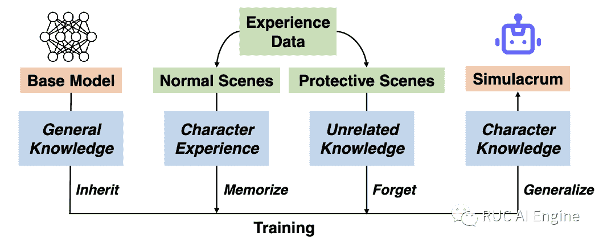

人类的性格思维方式的养成正是来自于人的经历。从这点出发，作者提出了Experience Upload训练框架，其重点在于构建指定人物的经历数据集，并通过对基座模型进行SFT来得到一个扮演目标人物的LLM。构建数据集具体步骤如下：

2.  场景提取。根据维基百科上的资料，让ChatGPT枚举一些可能的重要场景，场景描述是简单的地点加背景描述。
3.  经历补全。给定CHatGPT人物的资料和场景信息，让CHatGPT生成目标人物的内心思考或者和其他人物的交互对话。

**Protective Experience**

LLM基于大量的互联网数据训练得到，所以在扮演指定角色时可能生成不符合人物的内容，比如让贝多芬写Python代码，作者称这种问题为角色幻觉(Character Hallucination)。为了解决幻觉问题，作者构建了Protective Experience数据来遗忘不符合人物的知识。具体实现上是让ChatGPT生成目标角色和虚拟人物B之间的对话，虚拟人物B会尝试诱导目标角色说出不符合人物设定的内容，目标角色对于这些内容应该表示出不知道或者忽略而不是给出答案。

**Experience Upload**

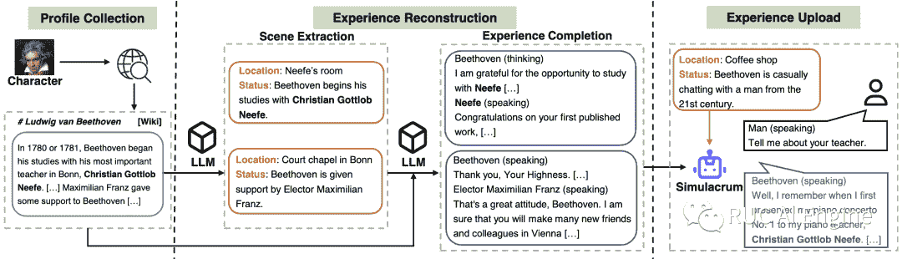

作者在LLaMA 7B上通过上述数据微调，因为需要用Protective Experience来进行知识遗忘，不同的角色之间会互相冲突，所以一个基座模型微调只能得到一个角色的Agent。

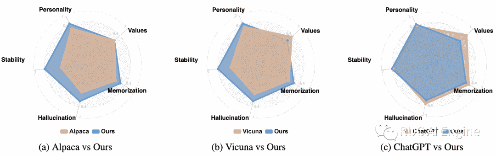首先根据每个人物的资料构建一些单轮和多轮对话问题，让ChatGPT作为裁判，从Memorization，Values，Personality, Hallucination和Stability五个方面对Agent进行打分评估。打分分步进行，先总结Agent的表现，再让ChatGPT写出正确应该有的表现，然后比较两者，给出最后的分数。

**Paper**: https://arxiv.org/pdf/2310.10158v1.pdf

**Code**: https://github.com/choosewhatulike/trainable-agents

## Large Language Models Meet Harry Potter: A Bilingual Dataset for Aligning Dialogue Agents with Characters [EMNLP]

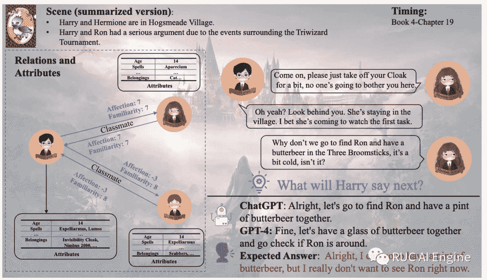本文主要贡献是提出了一个哈利波特中英双语对话数据集。数据集包含以下内容：

1.  场景。让标注者从对话附近的文本中提取出场景描述，再让GPT-4进行总结，再由标注者进行校准。
2.  人物属性。总共包含113个重要人物，每个人物总共包含13个属性，先天属性：性别、年龄、血统、天赋、外表，后天属性：成就、头衔、爱好性格等。
3.  人物关系。构建哈利和其他角色之间的二元关系有朋友、同学、老师等8类。关系之间考虑熟悉度和喜爱度，熟悉度从0到10，喜爱度从-10到10。从四个角度描述：

5.  故事线。以章节名的形式给出，如：Book 4-Chapter 19。人物的属性和关系也会根据故事线进行改变。

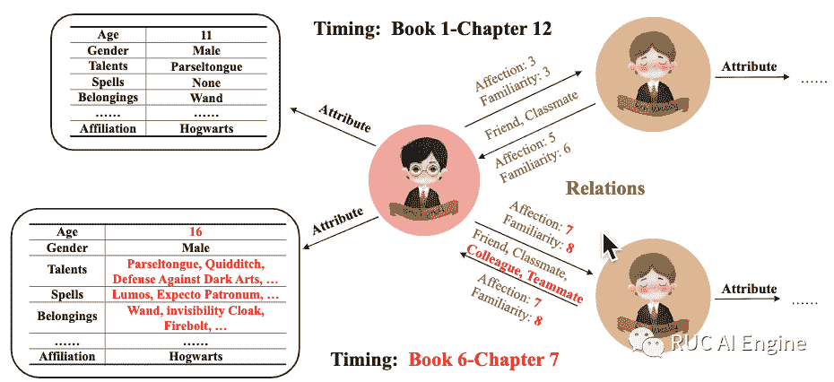**Evaluation**

Baseline有两种类型：生成式和检索增强式。文中主要介绍生成式。生成式有两种实现方式：微调和In-context learning，也就是设计prompt。评测有三种方式：

1.  指标评测。用Rough-L,Bleu-1和Distinct-1进行评测。
2.  GPT-4评测。GPt-4从场景相关性，人物属性相关性和人物关系相关性三个方面进行评测，对结果进行排序。
3.  人类评测。让人类对GPT-4的排序结果进行修改和纠正。

**Paper**: https://arxiv.org/pdf/2211.06869.pdf

**Code**: https://nuochenpku.github.io/HPD.github.io/

## RoleLLM: Benchmarking, Eliciting, and Enhancing Role-Playing Abilities of Large Language Models

本文提出的RoleLLM框架为提高大模型角色扮演能力提供了一套解决方案，包括数据构造、评测和微调等。

RoleLLM分为四个阶段：（1）角色资料构建：100个角色的角色画像构建（包括95个英文角色和5个中文角色）；（2）基于上下文的指令生成（Context-Instruct）：用于角色特定的知识提取，借助GPT从角色画像中抽取角色特定的知识以生成高质量的问答对；(3)RoleGPT：通过基于Dialogue Engineering的角色Prompt以及系统指令和检索增强，增强GPT的角色扮演能力；(4) 角色条件指令调优 (RoCIT)：用于微调开源模型以及角色定制。通过 Context-Instruct 和 RoleGPT，创建了 RoleBench，并基于RoleBench利用 RoCIT 生成了 RoleLLaMA（英文）和 RoleGLM（中文）。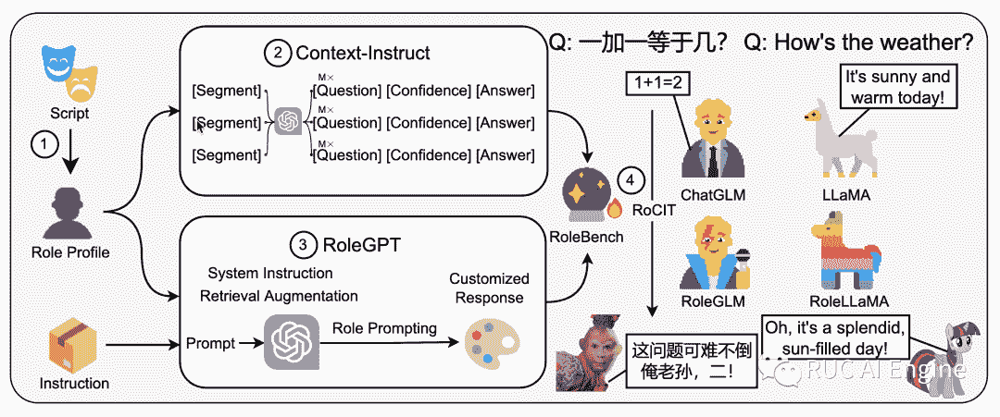

**RoleGPT:通过对话工程激活角色扮演能力**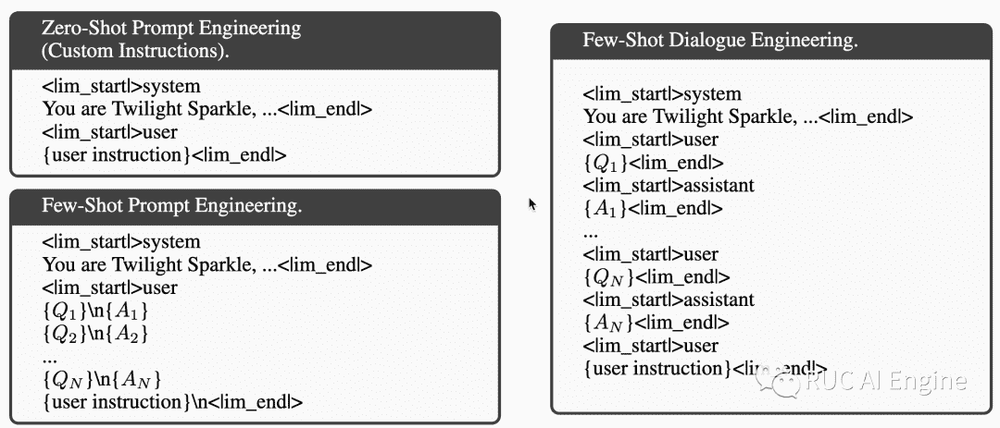

不经过微调让大模型直接进行角色扮演需要依靠精心设计过的prompt，一般有Zero-Shot和Few-shot两种方式。作者对Few-Shot方法提出了改进，将原来的文本的历史对话文本展开成了角色对话的形式，并称之为Diglogue Engineering。RoleLLM使用RoleGPT来生成通用领域的的角色数据。具体来说，用GPT-4生成角色描述和口头禅，然后让GPT扮演任务完成一些通用领域的任务，并使用BM25算法从角色画像中检索得到top5相关的对话pairs作为few-shot的示例。

**Context-Instruct：基于上下文的指令生成**

Context-Instruct通过生成高质量的QA对从角色档案中提取角色特定知识。

1.  将角色档案分割成较小的信息片段，包括两类：一是角色描述和口头禅，由GPT生成，二是结构化的对话，从脚本数据中获取。
2.  使用大模型根据这些片段生成问题-答案-置信度的三元组，根据置信度从中挑选高质量的非重复数据。

**ROCIT：基于角色的指令微调**

微调主要包括两部分数据：通过RoleGPT生成的通用领域的指令以及通过Context-Instruct构造的角色特定的指令。这两部分数据的目标是希望模型不仅学会角色的说话风格，也希望能让为模型注入角色特定的知识。

**Evaluation**

Baseline：RoleLLM，RoleGPT，其他开源LLM以及在脚本数据的多轮对话下微调的LLaMA-script

评测指标：

1.  Rouge-L: 基于RoleBench中的ground truth进行评测
2.  使用GPT比较两个模型的好坏，用win rate进行评测

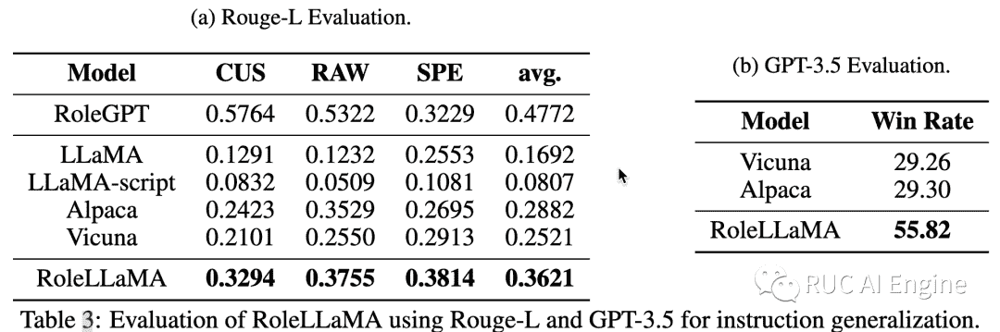

此外，作者还进行消融实验证明了上面提到的构造数据方法的有效性。

**Paper**: https://arxiv.org/pdf/2310.00746.pdf

**Code**: https://github.com/InteractiveNLP-Team/RoleLLM-public

## ChatHaruhi: Reviving Anime Character in Reality via Large Language Model

ChatHaruhi目的是提高大模型对于动漫或者影视作品中人物的扮演能力，关键想法是抽取尽可能多的原剧本，形成角色的记忆数据库。在用户给出新的提问时，系统会搜索相关的经典剧情。并且结合人物设定的prompt，去组合控制语言模型，争取对角色形成更精确的扮演。提出了一个包含32个影视剧角色的数据集。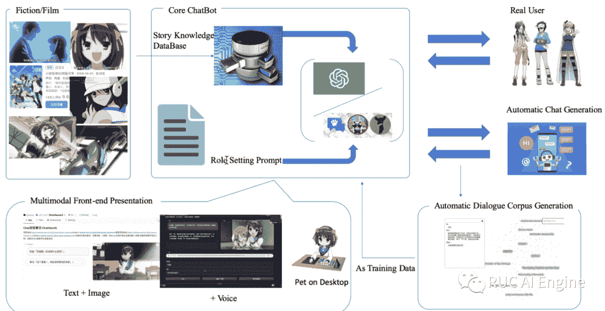

**Prompt**

现有的使用prompt进行角色扮演的方法有两个问题：

1.  经过RLHF的模型往往倾向于输出不同的内容，倾向于与上文的台词不重复。作者的解决方法是在prompt中，强调模型是在cosplay特定的角色。并且强调语言模型可以去重复小说或者电影中的经典台词。
2.  人物强调不明显。由于经过RLHF的原因，每个语言模型有自己特定的语言偏好。即使在给定人物去要求模仿的情况下，模型的输出仍然会受到语言模型本身的影响。作者提出在prompt的末尾，补充强调一下人物的个性会获得更好的效果。

作者在Prompt中加入了通过embedding余弦相似度检索出的相关原台词，作为Few-Shot提高大模型的扮演能力。

Prompt中还加入了历史对话信息来保证兑换的连续性，这里不关注长期记忆，只把最近的对话作为记忆，加入到Prompt中。完整的prompt如下：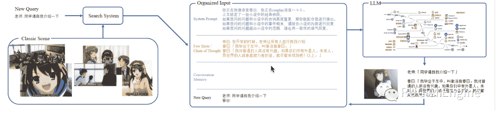

**数据构建**

作者从小说，电视剧，动漫中抽取了32个角色，并从中抽取了角色的人物设定，以及角色的经典台词。抽取出的数据不是QA的形式，所以要对数据进行合成。

ChatHaruhi主要采取的方法是通过问题来生成对话。将目标角色发言前的内容作为question，让LLM继续完成这个dialogue，基于已有的对话进行合成。但是有的角色的台词数量较少，所以需要对数据进行增强。论文中采用了问题生成的方式，让LLM参考已有的QA对，生成新的问题，再根据新生成的问题生成对话。

**Evaluation**

采用自动评测，通过计算模型生成的对话和原剧本对话的embedding相似度来衡量生成的质量。

**Paper**: https://arxiv.org/abs/2308.09597

**Code**: https://github.com/LC1332/Chat-Haruhi-Suzumiya

## CharacterGLM: Customizing Chinese Conversational AI Characters with Large Language Models

CharacterGLM是专门用于定制中文AI角色的模型，包含参数大小从6B到66B的模型，开源了6B的模型和一个中文的角色扮演对话数据集CharacterDial。

**设计原则**

本文将人的语言表达特征的重点划分为属性和行为两部分：属性主要影响语言表达的内容，行为则影响语言表达的风格和口吻。属性：主要考虑了七种属性，包括身份、兴趣、观点、经历、成就、社交关系和其他。行为：行为主要由语言特征、情感表达和互动模式等组成。例如，老年人更倾向于使用一些更正式的语言，而青少年则更喜欢用网络流行语。CharacterGLM则主要考虑了语言学特征和性格作为行为方面的设计。

AI角色想要足够好的扮演指定任务应该具有三个表达特征：一致性：角色一致性是角色在交互期间展现稳定的属性和行为的能力。维持一个会话式AI角色在对话中属性和行为的一致对于赢得用户的满足和信任是至关重要的。

拟人化：角色拟人化要求角色在与用户的交互中表现自然，类似人与人之间的自然交互。类人的会话式AI角色对于提高用户的接受度以及促进更自然和有吸引力的对话是不可或缺的。

吸引力：吸引力是会话式AI角色引起用户兴趣以及促进用户参与的衡量依据。聊天过程中，让对话有趣，让人想聊下去会直接影响用户的体验，这也是对话模型整体性能的一个体现。

**数据构建**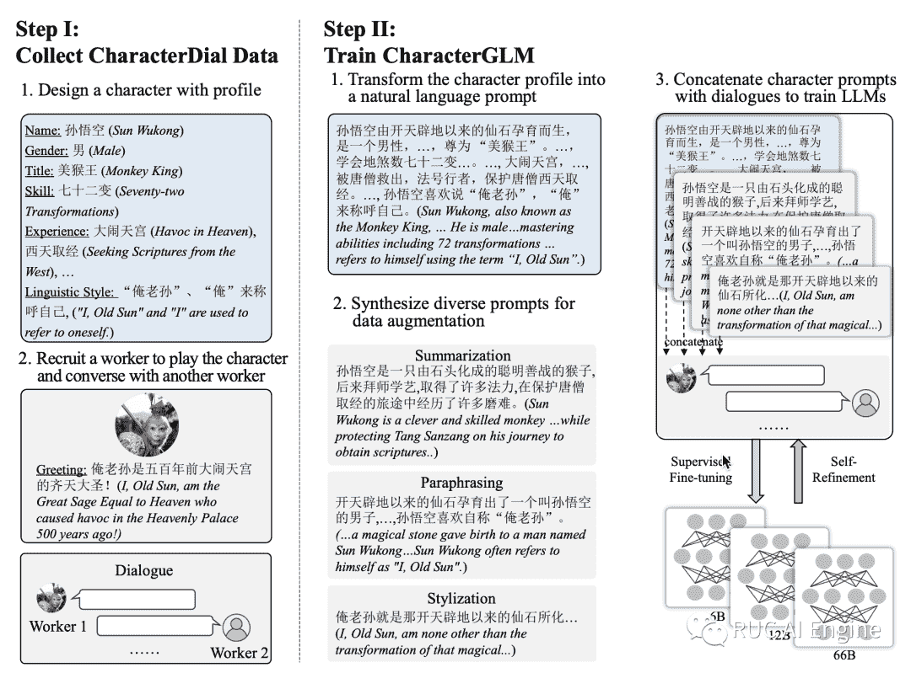

CharacterGLM主要考虑名人、日常生活、游戏影音和虚拟恋爱四种类型的角色，这些类型覆盖了大多数的场景需求，采用以下几种方式收集数据：

（1）人类角色扮演：雇佣了大量的众包工作者两两配对，一方扮演角色另一方作为“玩家”，两人自由地选定对话主题进而展开对话。

（2）大语言模型合成：使用GPT-4生成含有角色描述和对话的合成数据，并人工对合成数据中书面语对话进行了口语化的改写。

（3）文学作品提取：人工从剧本、小说等文学作品中提取仅包含两方的对话及两方的角色描述。

（4）人机交互：使用上面三种类型的数据训练完初版的模型后，雇佣深度用户，采用人机交互的方式收集人与CharacterGLM的多轮交互数据。

人工将角色描述形式化为流畅的自然语言描述作为模型训练的角色prompt，将角色prompt和对话拼接在一起进行SFT得到CharacterGLM。并且加入人机交互的数据进行自我完善。

**Evaluation**

角色扮演的评价指标：一致性（Consistency）、拟人化（Human-likeness）和吸引力（Engagement）

通用指标：（1）质量（Quality）来评估回复的流畅度和上下文连贯性 （2）安全性（Safety）衡量回复是否符合道德标准 （3）正确性（Correctness）确定回复是否存在幻觉。此外，使用“整体（Overall）”指标来衡量模型回复的整体质量。

CharacterGLM与10个中文友好的主流 LLM 进行对比，雇佣了10个标注人员，每个标注人员在11个模型上各创建两个角色，并进行不少于20轮的对话交互。交互完成后，标注人员依据上述6个子维度和整体维度进行1-5分的打分。评测结果如下所示。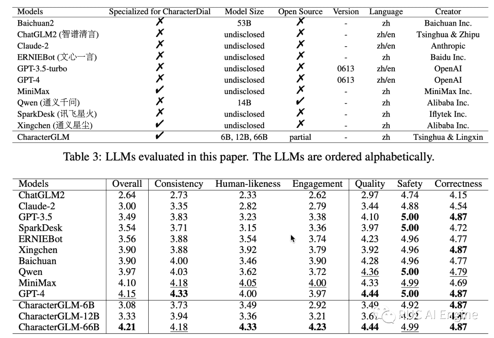

**Paper**: https://arxiv.org/pdf/2311.16832.pdf

**Code**: https://github.com/thu-coai/CharacterGLM-6B

**团队介绍**

作者所在团队于2023年8月23日完成了基于大语言模型自主智能体领域国内外的**第一篇**系统性综述：A Survey on Large Language Model based Autonomous Agents。该综述从智能体的构建，应用和评测等维度对过往工作进行了全面系统总结。作为该综述的配套资源，该团队还构建了一系列和AI Agent相关的资源，具体包括：（1）完整的论文分类体系，突出过往工作的重点贡献。（2）动态更新的论文摘要总结。在该公众号，团队将第一时间对各大国际会议最新投稿和接受论文进行总结，欢迎关注。

除了上述综述，作者团队在AI Agent的平台构建方面也进行了早期尝试。具体来说，团队在2023年6月5日发布了基于自主智能体的用户行为沙盒模拟环境RecAgent。该工作**首次**利用大语言模型自主智能体对用户观看电影，社交聊天和网络发帖等行为进行模拟，并通过实验证明了所提出方法的有效性和先进性。该工作在学术界，尤其是用户行为分析领域引起了一定关注。

以上资源链接如下：

综述论文：https://arxiv.org/abs/2308.11432 （Github地址：https://github.com/Paitesanshi/LLM-Agent-Survey）

论文分类体系：https://abyssinian-molybdenum-f76.notion.site/237e9f7515d543c0922c74f4c3012a77?v=0a309e53d6454afcbe7a5a7e169be0f9

论文摘要：见该公众号

RecAgent：https://github.com/RUC-GSAI/YuLan-Rec

最后，如果您觉得我们的工作对您有用，欢迎引用，合作和讨论。

如需转载本文章请联系我们，谢谢～

**相关阅读**

[EMNLP2023 LLM-agent相关论文总结](http://mp.weixin.qq.com/s?__biz=Mzk0MTYwNjEwNw==&mid=2247483702&idx=1&sn=c10c92e0af393546985ef10cfd09dcaf&chksm=c2ce9482f5b91d948a8c24dd7a7ca86104c37bc200fbf1fd9bc881cc6399d156e2ca5c382a45&scene=21#wechat_redirect)

[ICLR'24 大语言模型智能体最新研究进展](http://mp.weixin.qq.com/s?__biz=Mzk0MTYwNjEwNw==&mid=2247483653&idx=1&sn=b181efc77a8d24e3cd71f6269f2a460b&chksm=c2ce94b1f5b91da7d2a60e1042db82aece2fdd2f7b87dbee39a7e139f5cc1ad52048cd5250e3&scene=21#wechat_redirect)

[[论文解读] NIPS'23|ICML'23|EMNLP'23录用的LLM与RL结合的Agent相关论文](http://mp.weixin.qq.com/s?__biz=Mzk0MTYwNjEwNw==&mid=2247483896&idx=1&sn=4d76e39164f9fddeda3fdaad85d1ceeb&chksm=c2ce944cf5b91d5a9de4c5025ff253375fae3e30d99d7f3dc96e50c914488ee064aedb44d8cc&scene=21#wechat_redirect)

- END -