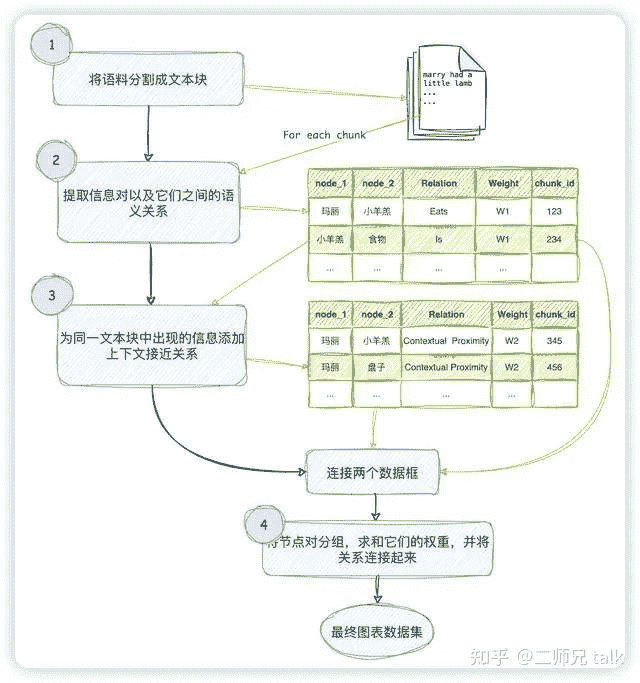
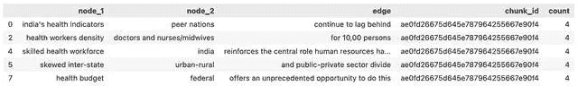
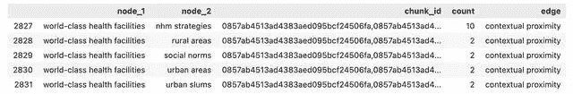
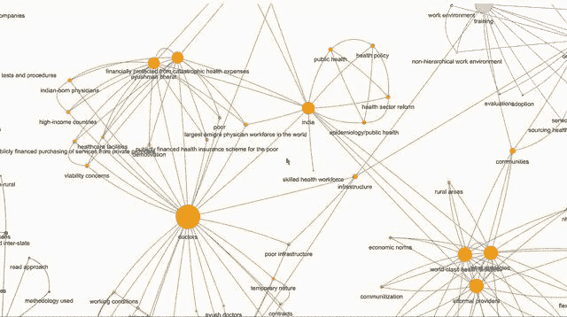

# 使用 LLM，将任何文本语料库转化为知识图谱

什么是知识图谱？

知识图谱，也称为语义网络，表示现实世界实体的网络，即对象、事件、情境或概念，并说明它们之间的关系。这些信息通常存储在图数据库中，并以图形结构可视化，因此称为知识“图谱”。

来源:
[https://www.ibm.com/topics/knowledge-graph](https://link.zhihu.com/?target=https%3A//www.ibm.com/topics/knowledge-graph)

## 如何从一篇作品中创建简单的知识图谱？

1.  清理文本语料库（作品）。
2.  从作品中提取概念和实体。
3.  提取实体之间的关系。
4.  转换为图架构。
5.  填充节点（概念）和边缘（关系）。
6.  可视化和查询。

第6步是完全可选的，但与此相关的确实有一定的艺术满足感。网络图是美丽的对象（只需看上面的横幅图，是不是很美？）。幸运的是，有许多Python库可用于生成图形可视化。

## 为什么使用图？

一旦建立了知识图谱（KG），我们可以用它进行许多用途。我们可以运行图算法并计算任何节点的中心性，了解一个概念（节点）对这篇作品有多重要。我们可以计算族群，将概念分组在一起以更好地分析文本。我们可以了解看似不相关的概念之间的关系。

最重要的是，我们可以实现图检索增强生成（GRAG），并使用图作为检索器以更深入地与我们的文档交流。这是**检索增强生成（RAG）**的新版本，其中我们使用向量数据库作为检索器，以便与我们的文档进行交互。

* * *

## 创建概念图

你如果问GPT如何从给定的文本中创建知识图，它可能会给你一些建议，就像下面的步骤一样。

1.  **提取概念和实体：** 从工作内容中抽取概念和实体，这些将成为图中的节点。
2.  **提取概念之间的关系：** 识别这些概念之间的关系，这些关系将成为图中的连线。
3.  **填充图数据库：** 将这些节点和关系填充到图数据结构或图数据库中。
4.  **可视化：** 进行可视化，以达到一些艺术上的满足感。

步骤3和4听起来很容易理解，但步骤1和2的实现方式是关键。

以下是我设计的一种从任何给定文本语料库中提取概念图的方法的流程图。虽然与上述方法相似，但有一些细微的差异。



文本语料库中提取概念图

1.  **文本分块：** 将文本语料库分成块，为每个文本块分配一个块 ID。
2.  **语义关系提取：** 对每个文本块使用 LLM 提取概念及其语义关系，为这些关系分配权重W1。同一对概念之间可能存在多个关系，每个关系都是一对概念之间的连接线。
3.  **上下文接近关系：** 考虑在同一文本块中出现的概念通过它们的上下文接近，为这种关系分配权重 W2。注意，同一对概念可能在多个块中出现。
4.  **分组和连接：** 对相似的对进行分组，总结它们的权重，并连接它们的关系。现在，我们只有一对概念之间的一条连线，该连线具有一定的权重和一组关系作为其名称。

你可以在我分享的 GitHub 存储库中查看这种方法的 Python 代码实现。一下是关于项目的关键点简要说明。

## Mistral和提示词

上述流程图中的第1步很容易。Langchain 提供了许多文本分割器，用于将文本拆分成块。

第2步是最有意思的地方。为了提取概念及其关系，我们使用 Mistral 7B 模型。

我使用了这些模型的4位量化版本，以确保 Mac 也能使用，并在本地使用 Ollama 进行托管。

这些模型都是经过指令调整的模型，具有系统提示和用户提示。如果告诉它们，它们将遵循说明，并将答案整齐地格式化为 JSON。

在经过几轮的尝试后，我最终选择了 Zephyr 模型，并使用以下提示：

```py
SYS_PROMPT = (
    "You are a network graph maker who extracts terms and their relations from a given context. "
    "You are provided with a context chunk (delimited by ```) Your task is to extract the ontology "
    "of terms mentioned in the given context. These terms should represent the key concepts as per the context. \\\\n"
    "Thought 1: While traversing through each sentence, Think about the key terms mentioned in it.\\\\n"
        "\\\\tTerms may include object, entity, location, organization, person, \\\\n"
        "\\\\tcondition, acronym, documents, service, concept, etc.\\\\n"
        "\\\\tTerms should be as atomistic as possible\\\\n\\\\n"
    "Thought 2: Think about how these terms can have one on one relation with other terms.\\\\n"
        "\\\\tTerms that are mentioned in the same sentence or the same paragraph are typically related to each other.\\\\n"
        "\\\\tTerms can be related to many other terms\\\\n\\\\n"
    "Thought 3: Find out the relation between each such related pair of terms. \\\\n\\\\n"
    "Format your output as a list of json. Each element of the list contains a pair of terms"
    "and the relation between them, like the follwing: \\\\n"
    "[\\\\n"
    "   {\\\\n"
    '       "node_1": "A concept from extracted ontology",\\\\n'
    '       "node_2": "A related concept from extracted ontology",\\\\n'
    '       "edge": "relationship between the two concepts, node_1 and node_2 in one or two sentences"\\\\n'
    "   }, {...}\\\\n"
    "]"
)

USER_PROMPT = f"context: ```py{input}``` \\\\n\\\\n output: "
```py

通过对每个文本块运行这个过程并将 JSON 转换为 Pandas 数据集，我们得到了如下结果。



Pandas 数据集

每一行表示一对概念之间的关系，是图中两个节点之间的一条连线。同一对概念之间可能存在多条连线或关系，而上述数据集中的计数是我随意设置的权重4。

## 上下文相关性

在文本语料库中，彼此靠近的概念之间可能存在相关性。我将这种关系称为'上下文相关性'。

为了计算上下文相关性的关系，我们合并了数据集，将 node_1 和 node_2 合并成一个单独的列。然后，我们使用 chunk_id 作为键对此数据集进行自连接。这样，具有相同 chunk_id 的节点将配对形成一行。

但这也导致每个概念与自己形成配对。这种自循环是一种连线从一个节点开始并在同一节点结束的情况。为了删除这些自循环，我们删除数据集中所有node_1和node_2相同的行。

最终，我们获得了一个与原始数据集非常相似的数据集。



数据集

这里的计数列表示 node_1 和 node_2 一起出现的块数。chunk_id 列是所有这些块的列表。

因此，我们现在有两个数据集，一个用于概念之间的语义关系，另一个用于文本中提到的概念之间的上下文接近关系。我们可以将它们合并以形成我们的网络图数据集。

我们已经完成了为文本构建概念图的工作。但是，将其停留在这一点将是一个相当不令人满意的练习。我们的目标是像文章开头的特色图像一样可视化图表，而我们离目标并不远。

## 创建知识网络

NetworkX 是一个让图像处理变得更容易的 Python 库。将数据集添加到 NetworkX 图中只需要几行代码。

```
import networkx as nx

G = nx.Graph()

## 将节点添加到图中
for node in nodes:
    G.add_node(str(node))

## 将连线添加到图中
for index, row in dfg.iterrows():
    G.add_edge(
        str(row["node_1"]),
        str(row["node_2"]),
        title=row["edge"],
        weight=row['count']
    )
```py

Network 很强大，为我们提供了许多现成的网络算法。在这里，我使用了一个族群检测算法为节点添加颜色。族群可以理解为更紧密地相互连接的节点组。

Girvan Newman 算法在用例文章中检测到了17个概念族群。以下是其中一个族群。

```
[
  'digital technology',
  'EVIN',
  'medical devices',
  'online training management information systems',
  'wearable, trackable technology'
]
```

我们还计算图中每个节点的度。节点的度是它连接的连线的总数。节点的度越高，它在文本主题的关注度就越高。我们将使用度数作为可视化中节点的大小。

## 图形可视化

Pyvis 是一个用于可视化网络的 Python 库。他有一个内置的 NetworkX 库，将 NetworkX 图转换为 Pyvis 对象。

我们将计算的每条连线的权重作为连线的厚度，节点族群用作颜色，以及每个节点的密集度以用作它们的大小。

下面是图形效果：



图形

我们可以随意地放大、缩小、移动节点和边缘。在页面底部还有一个滑块面板，可以更改图的物理性质。看看图是如何帮助我们发现问题并更好地理解关系网络的。

你也可以进一步探索图是如何帮助构建图形增强检索，以及如何帮助构建更好的 RAG 管道。

**Github 地址**: [https://github.com/mcks2000/llm_notebooks](https://link.zhihu.com/?target=https%3A//github.com/mcks2000/llm_notebooks)

* * *

**关注我** 获取更多资讯，并在 知乎 上阅读我的短篇技术文章