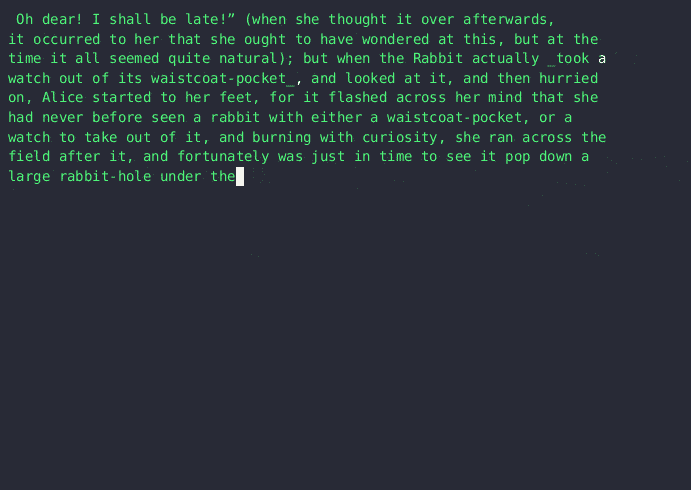

<!--yml

category: 大模型

date: 2024-05-08 10:27:01

-->

# 使用（滥用）LLM 压缩文本

> 来源：[`o565.com/llm-text-compression/`](https://o565.com/llm-text-compression/)

### 介绍

大型语言模型是在大型文本数据集上进行训练的，以学习更大文档中单词的关系和上下文。这些关系是模型生成文本的基础。

最近，我读到了关于 LLMs 被训练在受版权保护的文本上并将其复制的担忧。这让我想：可以从 LLM 中提取训练文本吗？答案当然是肯定的，而且这不是一个新的（或开放的）问题。这让我想知道提取整本书需要什么，或者让 LLM 复制它从未直接训练过的文本需要什么。我想，大部分情况下，许多文本包含自然与模型学习的语言关系相一致的部分。如果是这样，那么也许我可以使用模型来推断这些关系，并在它偏离时纠正它的行为。

这就是我到这里的方式。

要看看这是否起作用，我决定使用我熟悉的技术。我将通过其[python 绑定](https://github.com/abetlen/llama-cpp-python)使用[llama.cpp](https://github.com/ggerganov/llama.cpp)。

### 工作原理...

我组装的解决方案具有以下关键功能：

**`load_document(filename)`**：

+   这会读取文本文件并使用模型的分词器对其进行分词。如果文本过长以至于超出模型的上下文窗口，它将被分成适合该窗口的更小部分。这可以防止标记溢出。

**`generate_text(prompt, max_tokens=1)`**：

+   这使用 0.0 作为温度和一个固定的种子，以 n 个标记一次生成文本。它基本上从输入文本停止的地方继续文本。

**`compress_text(source_text)`**：

+   此函数尝试使用 LLM 生成输入文本的部分来压缩它。如果生成的文本与源文本的开头匹配，则继续进行 - 否则，它直接将字符添加到压缩字符串中。

+   为了记录生成的文本，函数记录了生成了多少标记，并将该数字放置在分隔符之间。

**`decompress_text(compressed_text)`**：

+   解压由`compress_text`函数压缩的文本。它使用分隔符分割文本，并通过生成缺失部分或直接附加文本来重建原始文本。

### 测试

我用两个文本进行测试。对于第一个，我决定使用《[爱丽丝梦游仙境](https://www.gutenberg.org/cache/epub/11/pg11.txt)》的第一章，因为我假设它会在模型的训练数据中。正如我预料的那样，我得到了非常好的压缩。

#### 压缩

这是压缩函数的核心：

##### 代码

```py
 """Compress text by generating and comparing segments to the source text."""
    generated_text = ""
    compressed_string = ""
    gen_count = 0
    i = 0
    # let's loop until we have generated the entire source text
    while generated_text != source_text:
        # get a new token
        part = generate_text(generated_text)
        # if our generated text aligns with the source text then tally it
        if source_text.startswith(str(generated_text + part)) and len(part) > 0:
            gen_count += 1
            generated_text += part
            i = len(generated_text)
            if debug:
                print(BLUE + part + RESET, end="", flush=True)
        # if not, then grab a letter from the source document 
        # hopefully we'll be back on track during the next loop
        else:
            i += 1
            if gen_count > 0:
                compressed_string += f"{re.escape(DELIMITER)}{gen_count}{re.escape(DELIMITER)}"
                gen_count = 0

            generated_text += source_text[i - 1]
            compressed_string += source_text[i - 1]
            if debug:
                print(source_text[i - 1], end="",  flush=True) 
```

##### 结果

这是模型处理脚本的过程。蓝色的文本是由 LLM 生成的，白色的文本是源文本。是的，速度很慢。


#### “压缩”内容：

这是输出的样子。是的，它是以 JSON 格式呈现的，而且是丑陋的，但这只是一个概念验证，对吧？为了在这篇帖子中更加清晰，我选择了一个易于阅读的分隔符：@

这是第一章的完整“压缩”文本。

```py
["\ufeffCH@2@I.@1@Down@7@\n\n@15@\n@18@\n@13@\n@6@ \u201c@17@s@2@\n@79@ _@13@ _@72@ a\n@10@_,@106@ how@100@as@51@cup@24@ down@26@\u201d,@4@\n@17@\n@3@ underneath@11@cup@62@ fell@9@Which@23@?@4@\n@19@\n@35@ lear@2@se@12@room@2@\n@5@ _@25@ go@1@d\np@20@\n@19@ no@13@ thought@2@ nice@22@ _@2@\n@16@ walk@5@ward@12@she@3@gl@11@,@9@the@1@ word@7@ to@27@\n(and@21@\n@120@ Din@59@ here@5@ get@15@ream@19@\n@82@ tell@111@ the wind@21@ e@55@ a@50@ walked@11@\n@43@first@35@\n@104@\n@43@,@31@ would@7@ should@21@,@6@ h@43@\n@17@\n@17@\n@17@\n@8@,@11@,@21@,\u201d@2@ on@2@ large@23@ was@5@ _@1@_@21@ it@4@_@12@\nse@2@ nice@1@ hist@8@,@2@e@6@ and@9@_@34@\n@1@ th@1@t@5@ _@45@soon@11@ _@63@hot@3@,@10@*     @3@     @3@     @1@     @3@    *@10@\n@1@*@10@     @27@\n@20@right@5@ that@14@ that@9@wait@35@\n@36@fl@4@ is@36@ going@11@ for@3@ when@37@\n@13@ and@6@ cl@34@sat@7@Come@16@\nr@2@;@16@ very@2@,@24@\n@49@But@69@ very@3@ on@17@Well@14@ if@23@ can cre@11@\n@37@,@39@ generally@13@ much@28@ life"] 
```

###### 11,994 到 986 个字符

哇，这减少的量相当大。压缩后的文本仅为原始大小的约 8%。

为了好玩，我压缩了[整个文件](https://www.gutenberg.org/cache/epub/11/pg11.txt)。这种方法将字符数从 174,355 减少到 25,360 - 压缩后的文本占原始文本的 15%。

#### 解压缩

如果我不能反向压缩，那么压缩就毫无意义。让我们来看看解压缩函数：

##### 代码

```py
 decompressed_text = ""
    # split the parts into sections, text and generation counts
    parts = re.split(rf'({re.escape(DELIMITER)}\d+{re.escape(DELIMITER)})', compressed_text)  

    for part in parts:
        # if we're looking at a generation count, then generate text
        if re.match(rf'{re.escape(DELIMITER)}\d+{re.escape(DELIMITER)}', part): 
            number = int(part[1:-1])   
            for count in range(number):
                part = generate_text(decompressed_text)    
                if debug:
                    print(GREEN + part + RESET, end="",  flush=True)
                decompressed_text = decompressed_text + part
        else:
            # just add the text to the decompressed string
            decompressed_text += part
            if debug:
                print(part, end="",  flush=True) 
```

##### 结果



它有效了！

### 还有一件事

+   我不知道这个在不同 GPU 上的表现如何，因为我听说输出可能会有所不同。虽然我没有测试这个的能力，但我确认结果在 GPU 和 CPU 之间是一致的。

+   我还没有把脚本上传到 Github。一旦我上传了，我会在这里发布。

#### 这是这篇帖子的一个草稿版本，经过压缩：

```py
["\nWarning@1@ What f@1@ows@1@ not practical, well@1@written,@1@ finished@5@lso probably not the@1@ idea. It was fun th@1@u@1@h.@1@Int@1@duction@1@Large language@1@ are trained@1@ huge datas@3@ to learn the relationships and contexts of@1@ within larger doc@1@ments@1@ These relationships are what@1@s the@3@ text.\nRec@1@ I@2@ read concerns@1@ LL@2@ trained@1@ copyright@1@ text and repro@1@ing@1@.@1@ got@2@: Can training text be extracted@5@ The@1@, of@4@, and this@1@n@4@ (@1@ open@1@ question@1@ This led@3@ what it@1@ take@1@ extract entire@1@- or have an LL@1@ repro@1@e text it'@1@ ne@1@r dire@1@tly been@3@ I fig@1@ed that, for@1@ most@2@ many texts contain sections@1@ would natur@1@y align@2@ language relationships the@4@ If that@2@ the@2@ then@1@ I@2@ the@2@ infer those relationships@1@ correct its course whenever@1@ dev@2@.@1@So th@1@t@2@ how@1@ got@1@. @1@To see@2@ would@5@ use technology th@1@t I am@2@.@1@'ll use ll@3@ via its p@1@hon bind@1@.\nHow@1@ Works...\n@1@ solution I put@1@ has the@1@ key fun@2@ns@2@load@1@document(fil@1@ame@1@\n@1@ reads a@3@ token@2@ using@1@ model@2@ to@1@n@2@ If@1@ text@3@ for@2@'@5@ is@2@ smaller parts th@1@t fit@1@ this@2@ This prev@1@ token over@1@ow.@13@):@2@ generates@1@, n@1@ at@3@ w@1@h 0.0 as@3@ a static@1@. It ess@1@i@1@y continues@1@ text@2@ the input text stopped@2@compress@3@sour@1@e_@1@):@3@ attempts@3@ input@1@ by generating parts@4@ LL@3@ the@1@ te@1@ mat@1@s@1@ start@2@ source@2@ it continues\u2013 o@1@rwise@2@ adds@1@ character directly to@1@ comp@1@ string@1@\nTo record@1@ generated@2@ the fun@1@ion notes how@1@ tokens@1@ gener@1@ed@1@ places that@1@ between a del@1@.\nde@10@De@2@ text comp@2@ the compress@8@ te@1@ using@3@er@1@ recon@5@ by generating missing@1@ or directly app@1@ the text.@1@Testing\nI used two texts for t@1@t. For@2@,@1@ decided@2@ the@4@Al@8@\"@1@ I ass@1@med@3@ in@7@ As I@2@ I got very good compression. @1@Com@1@\nHere'@1@ the meat@2@ compression function@2@Code@1@\nResults@1@Here'@1@ the model processing@1@ script. The text in blue mat@1@s text gener@1@ed@2@ LL@1@ and white is from@1@ source@2@ Yes@4@ slow. @2@The \"Com@2@ content:@1@Here@2@ wh@1@t@1@ output@2@. Yes@4@ in JSON@1@ and@1@ it@2@ u@1@y,@1@ this@1@ just@4@, right@1@ For@3@ clarity in@4@ pic@1@d an easy@4@ del@1@: @\nThis@3@lete \"@4@ of Chapter@2@.@2@De@2@ @1@Com@1@ion is point@1@ if I@3@ reverse@2@ Let@2@ look@1@ the@1@p@1@s@8@\nIt@2@\nNot@2@I don@2@ know@3@ will perform ac@1@s@1@ GP@1@, as@1@'@1@ heard@1@ outputs cou@1@d@2@ While I don@3@ the ability@3@,@1@ confirmed@1@ the results@2@ bet@1@en a GPU@5@I haven@2@ gotten arou@1@d@1@ u@1@oad@1@ the sc@1@t@2@hub. Once I@5@ post it@3@Here'@1@ this post, comp"] 
```

###### 3,436 到 2,691 个字符

如预期的那样，该方法在模型已经训练过的数据上表现更好，但仍然会有一些大小的减少。

#### 想法

+   这个模型很庞大

+   训练一个用于压缩目的的模型是否实用？

+   这种方法能用于识别任何用于训练模型的数据吗？

+   不同的模型是否会产生更好的结果？

+   这个方法能扩展到其他数据类型吗，比如图片？

## 代码

[演示 https://o565.com/llm-text-compression/ - llm_compression.py](https://gist.github.com/0xDigest/67149a385762b57810323ba4e1669ae2)
